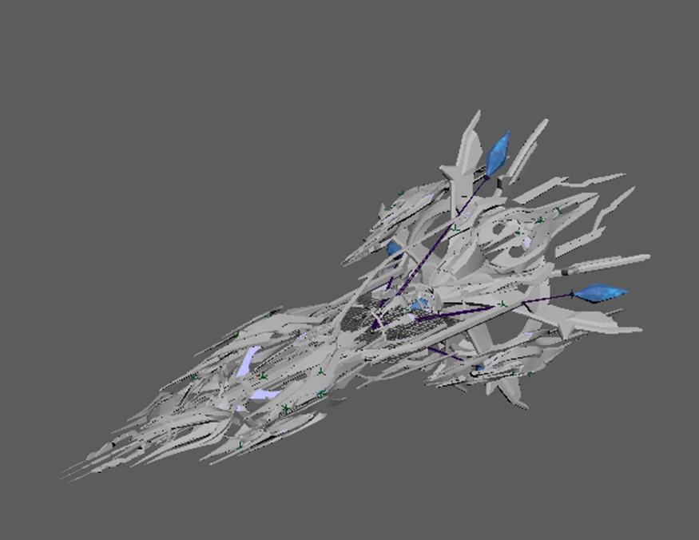
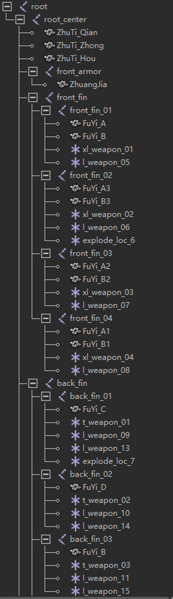
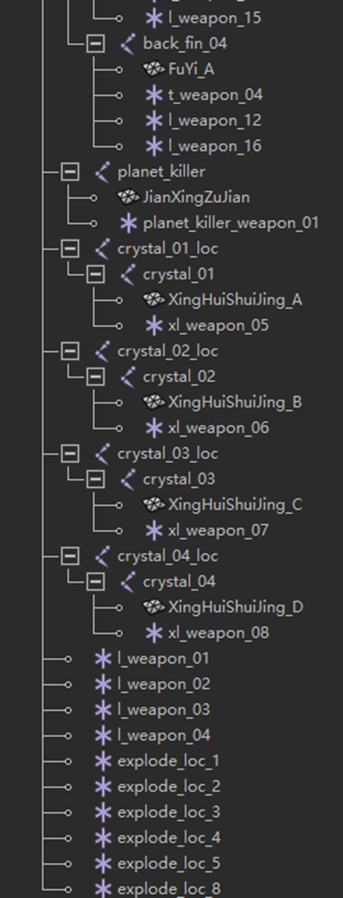
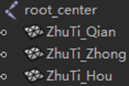
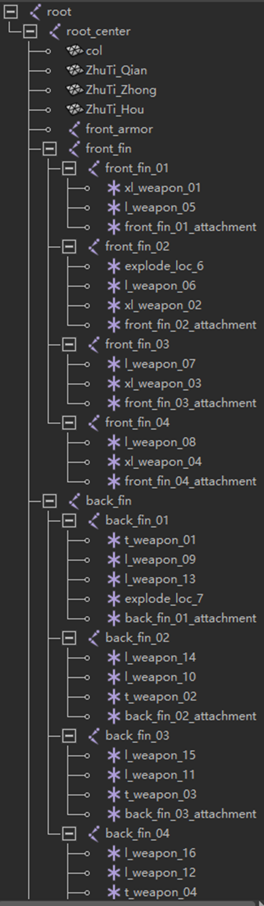
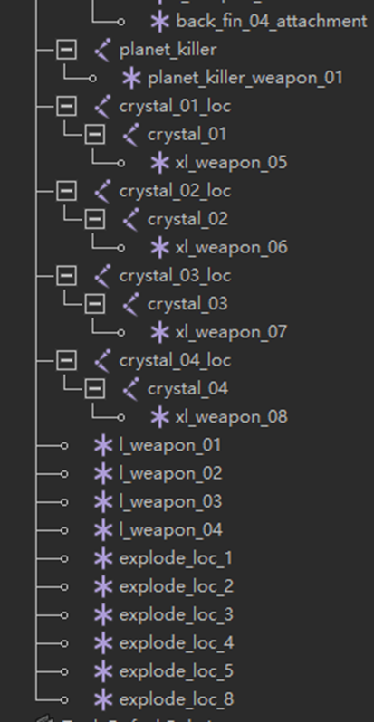

这是一个简易的 Stellaris 模型动画导出教程，由于本人水平有限，因此无法做的非常详细，
必须要假设看教程的善良人有一定的 Maya 动画基础，以及知道如何导出没有动画的模型。

因为一些奇妙的原因，Stellaris 导出带有动画的模型时，若要导出的模型包含多张贴图
并且不同贴图对应的模型依托不同的骨骼的动画，导出时模型可能会意外损坏，导致部分模型消失。
这个问题可以通过调整关节权重解决，不过这是一个麻烦的工程，此处介绍一个简易的不调整关节权重的导出方法。

## 模型概览

如下图是一个没有动画的奇怪的模型，以及带有骨骼的大纲视图。其中每个活动部件都由一个关节（joint）控制，要随部件活动的定位器（locator）都放在对应的关节下。



<span style="
width: 100%; align-items: center; font-size: 0.75 rem;
display: flex; flex-direction: row; justify-content: center;
">
模型外观
</span>





<span style="
width: 100%; align-items: center; font-size: 0.75 rem;
display: flex; flex-direction: row; justify-content: center;
">
骨骼 - 大纲视图
</span>

## 制作动画

**在不绑定蒙皮的情况下制作好模型动画，注意动画只能操作关节，不能直接操作关节内的模型。**

完成后选择一组无动画的部分，此处选择 `ZhuTiQian` 、`ZhuTiZhong`、`ZhuTiHou`
（以及碰撞箱模型 `col`，此处截图中没有，但是仍可和前三部分模型一起绑定蒙皮处理）
（其他部分其实也有没有动画的，比如 `Zhuangjia` ，也可以和前三个一起导出，不过制作的时候不知道未来要不要动于是就没塞进来）
，与 `rootcenter` 关节绑定蒙皮。其余部分不绑定蒙皮。



## 导出模型

随后删除除了刚才绑定蒙皮的 `ZhuTiQian` 、`ZhuTiZhong`、`ZhuTiHou` 以外的所有模型，
即 `Zhuangjia`、`FuYiA`、`FuYiB`、`FuYiC`、`FuYi_D`……，得到如下模型（大纲视图）。





<span style="
width: 100%; align-items: center; font-size: 0.75 rem;
display: flex; flex-direction: row; justify-content: center;
">
骨骼 - 导出后（带动画）- 大纲视图
</span>

其中名为 `xx_attachment` 的定位器为定位那些会旋转的组件使用的（见下文），其位置和所属关节重合，但进行了一定的旋转。

**导出这个模型，即可获得一个动画正常，但是没有搭接其他组件的模型以及需要的动画文件。**

带动画的部分导出完毕后，剩余部分（使用撤销恢复这些模型）都是一些无动画的模型（当然也可以有动画），
将它们单独导出（即删除除了它自己之外的其他东西，例如之前导出的模型主体以及其他和它类似的组件），
即将 `Zhuangjia`、`FuYiA`（前后两种不同的模型，此处狡猾建模命名相同无法区分）、`jianxingzujian`、`xinghuishuijingA` 作为 5 个不同的模型单独导出，获得 5 个零件。

## 注册模型与拼接

所有模型和零件导出完毕后，通过 `.asset` 中注册 `entity` 时的 `attach` 机制将它们拼在一起既是一个包含动画的完整模型，拼接方式如下：

```pdx
attach = { front_armor = "ags_SRA_SOGZ_front_armor_entity" }
attach = { front_fin_01_attachment = "ags_SRA_SOGZ_front_fin_entity" }
attach = { front_fin_02_attachment = "ags_SRA_SOGZ_front_fin_entity" }
attach = { front_fin_03_attachment = "ags_SRA_SOGZ_front_fin_entity" }
attach = { front_fin_04_attachment = "ags_SRA_SOGZ_front_fin_entity" }
attach = { back_fin_01_attachment = "ags_SRA_SOGZ_back_fin_entity" }
attach = { back_fin_02_attachment = "ags_SRA_SOGZ_back_fin_entity" }
attach = { back_fin_03_attachment = "ags_SRA_SOGZ_back_fin_entity" }
attach = { back_fin_04_attachment = "ags_SRA_SOGZ_back_fin_entity" }
attach = { planet_killer = "ags_SRA_SOGZ_planet_killer_entity" }
attach = { crystal_01 = "ags_SRA_SOGZ_crystal_entity" }
attach = { crystal_02 = "ags_SRA_SOGZ_crystal_entity" }
attach = { crystal_03 = "ags_SRA_SOGZ_crystal_entity" }
attach = { crystal_04 = "ags_SRA_SOGZ_crystal_entity" }
```

其中由于同一个组件要以四个不同的旋转角度拼接在模型上，而直接导出的骨骼并不会记录旋转属性，因此需要使用位置和关节重合但是旋转了一定角度（此处为绕 z 轴旋转 0°，90°，180°，270°）来作为组件的搭接点。

调用这个拼接好的模型即可绕开麻烦的刷权重过程，是不是很方便呢（笑）？
