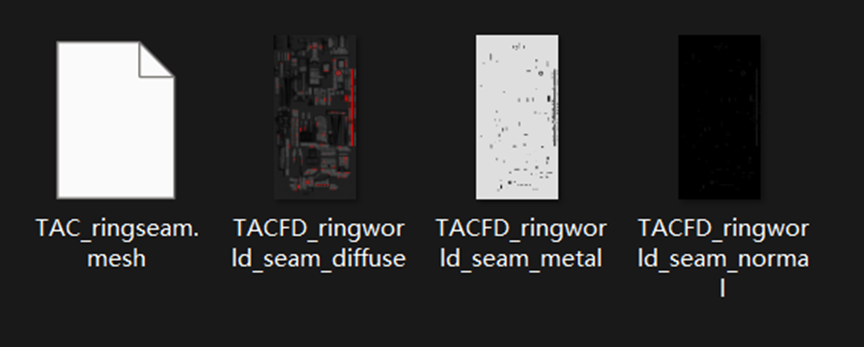
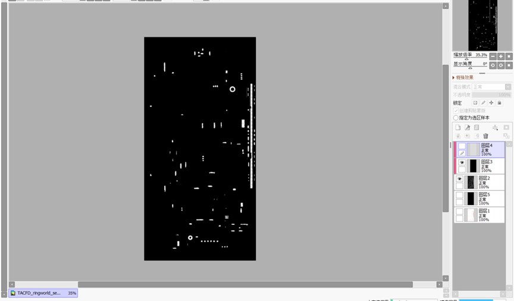
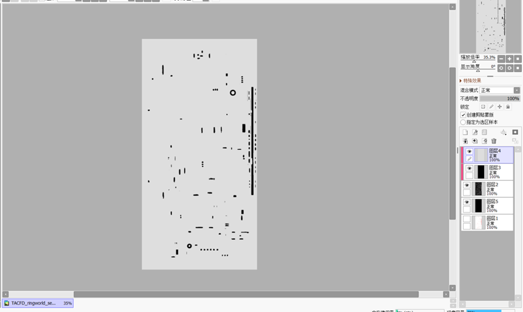
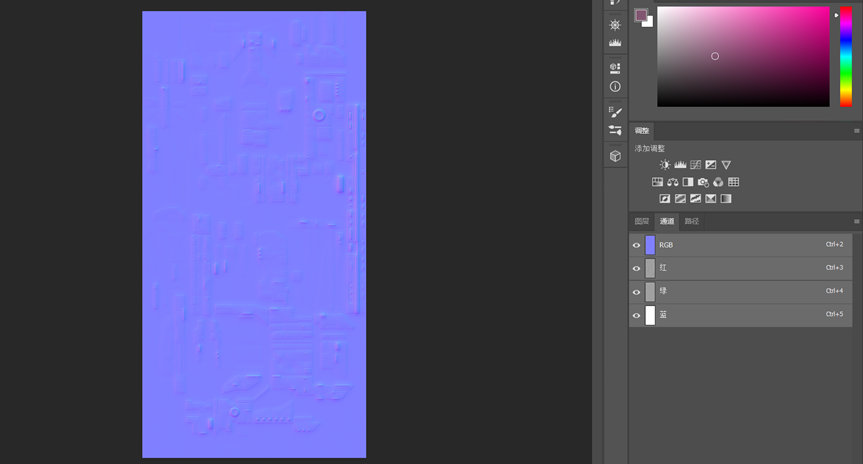
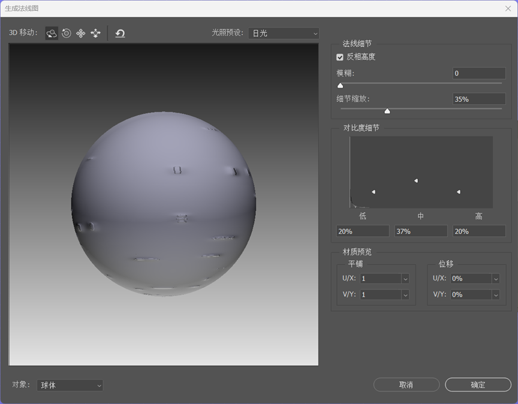
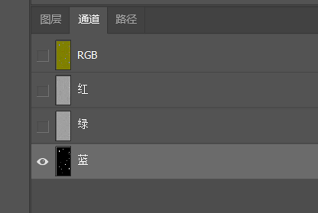
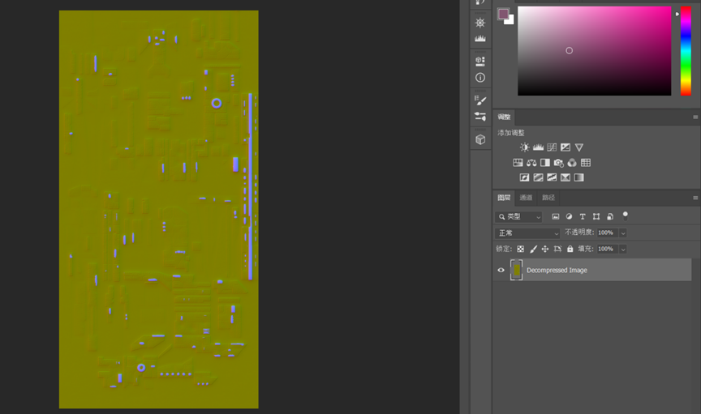
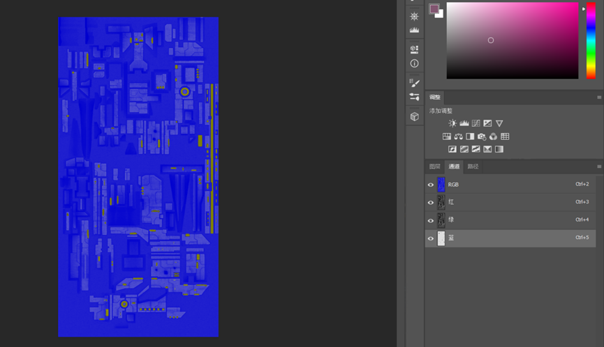

## 使用说明

1. 本方法适用于已经有 diffuse 的情况。
2. 本方法适用简单模型，复杂的模型和对细节要求高的模型本方法效果不佳。
3. 本方法需要准备的软件：PS（必要）（演示中用的软件是 sai2，并不是必要的）。

**想认真学习模型的 modder 最好还是学习一下 Substance Painter。**

## 如何操作

首先。如图所示，你现在有了一个模型（mesh）和一个 diffuse 贴图，第一步就是先做出图中的后面两个材料。

这一步我们要先做一个黑黑的蒙版，normal 在蓝通道透明的地方就能在群星里有发光效果，
所以可以理解为黑色的部分在 normal 蓝通道里起一个遮光的作用，
把想要发光的地方扣出来如图所示，然后其他部分涂黑，设置背景为透明导出为 png 备用。

金属度和上述的 normal 同理，这个越白，金属光泽越高。
通过调整颜色深浅可以调整不同地方的金属度（**注**：如果你的模型长得白白的，金属度最好调低一点，不然会很亮）。
最后导出备用。

原贴图在 ps 中去色（最顶端左数第三个按钮“图像” ➡️ “调整”中操作）然后在滤镜（最顶端左数第七个按钮）中“3d”选项中选择“生成法线图”，然后随便调整一下细节（真·随便）。

:::note[提示]

记得反相高度

:::

把我们上面处理好的黑色遮罩放进蓝通道里。

然后就快大功告成了！记得把透明度改成需要的效果，这一步不想试就无脑 50%（亲测有效）

同理处理一下 specular，和 normal 不同的是，specular 不需要 3d 滤镜，diffuse 去色后直接把我们刚刚准备的灰色贴图放进蓝通道里吧。
调整一下透明度（也可以无脑50%）。
