## 第一步：下载IDEA

官网网址：[https://www.jetbrains.com/zh-cn/idea/](https://www.jetbrains.com/zh-cn/idea/)

两个版本，你要是有钱可以下上面那个，下面那个是官方免费的！

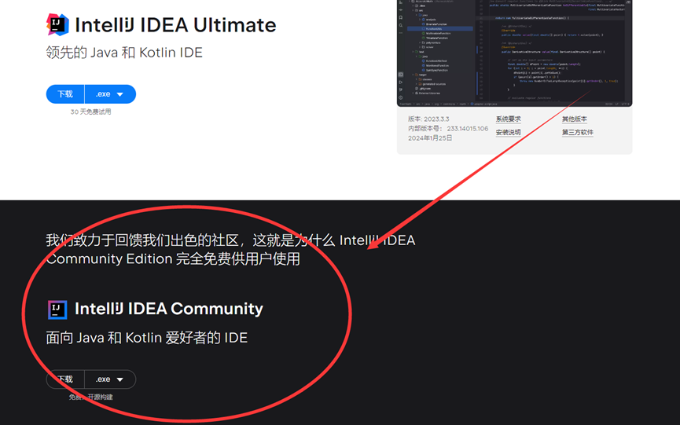

等待下载完成。

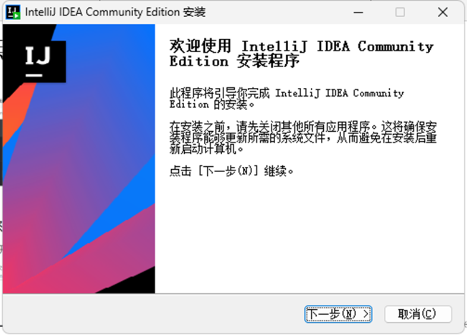
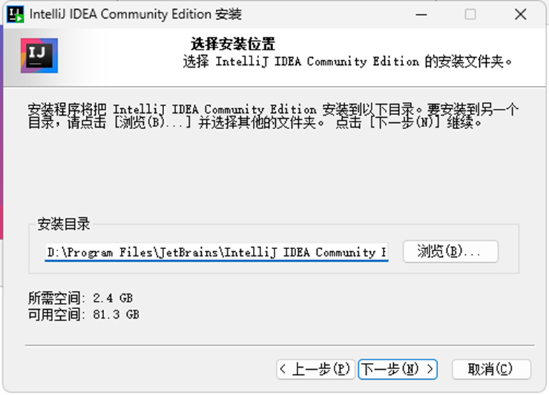
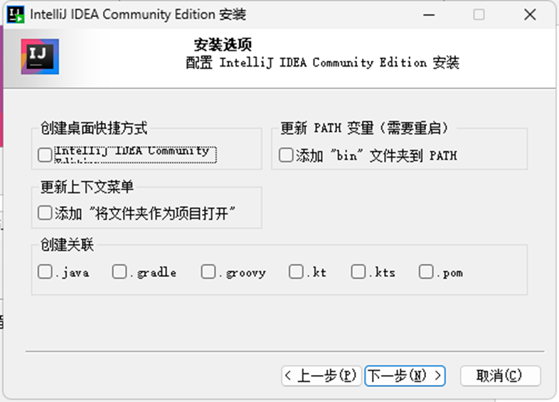
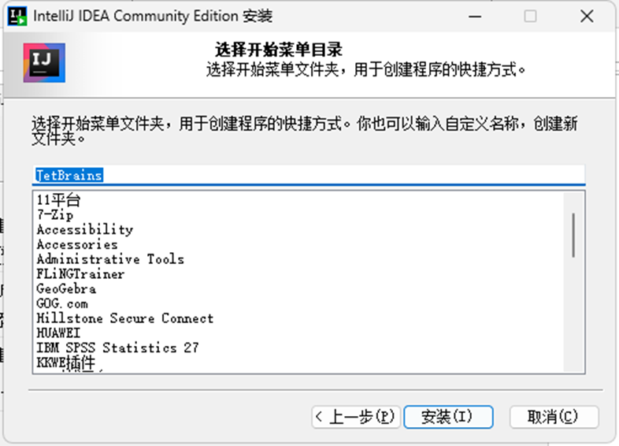
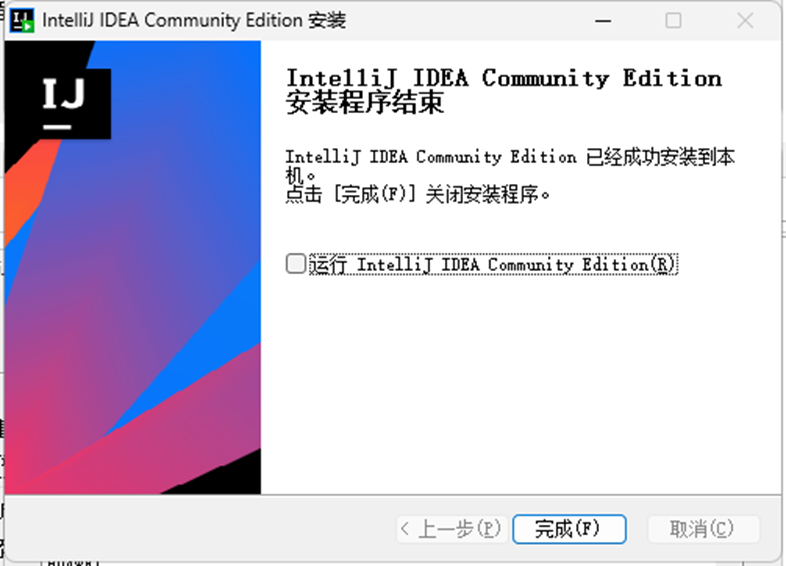

## 第二步：先设置中文，再安装支持插件

搜索 Chinese，下载。

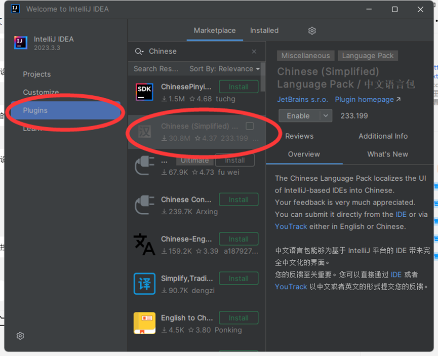

搜索 Paradox，下载。

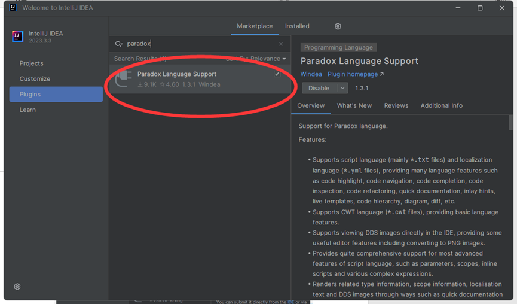

下载好后，开启（即为 √），重启IDEA。

## 第三步：打开你的MOD目录

:::warning

注意是你某个 MOD 的整个，而不是 MOD 里的某个文件或者文件夹！！！！

:::

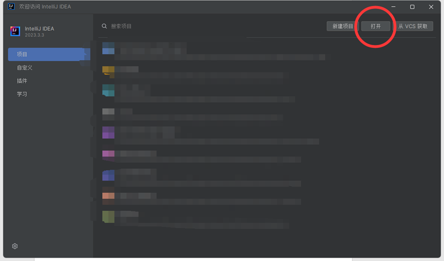
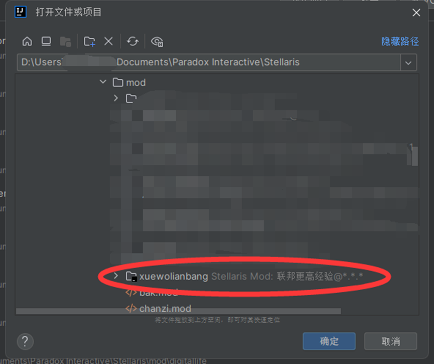

## 第四步：设置你的游戏目录

打开 `descriptor.mod`，右上角会存在齿轮，点击打开。

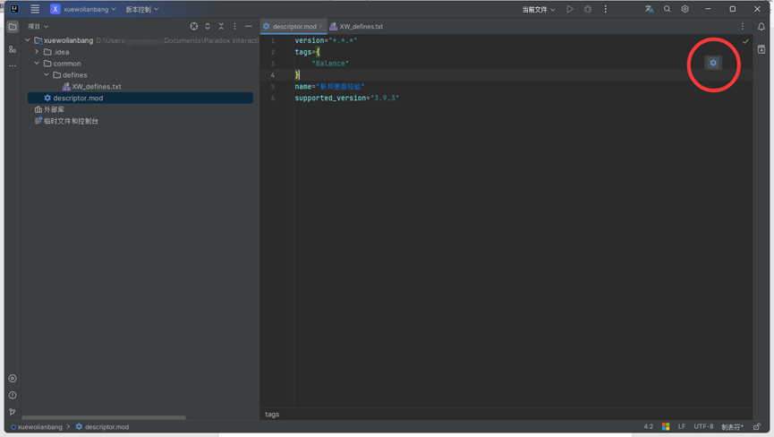

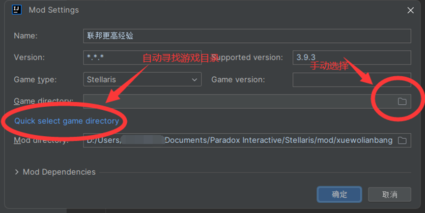
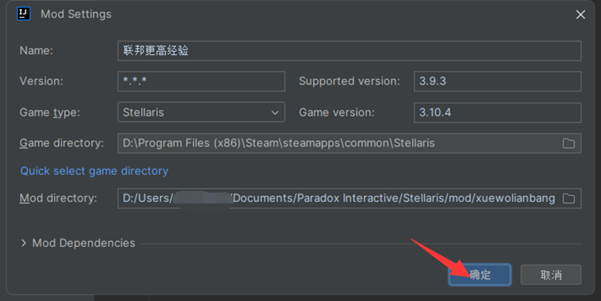

如果配置正确，会在 “外部库” 出现如下：

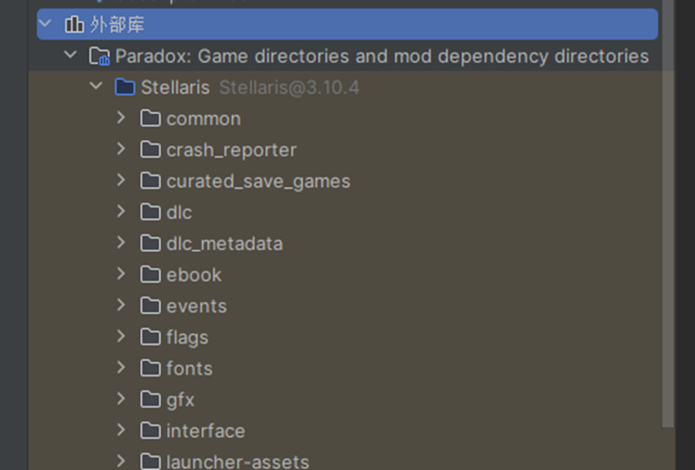

好了，开始你的 modder 之旅吧。
