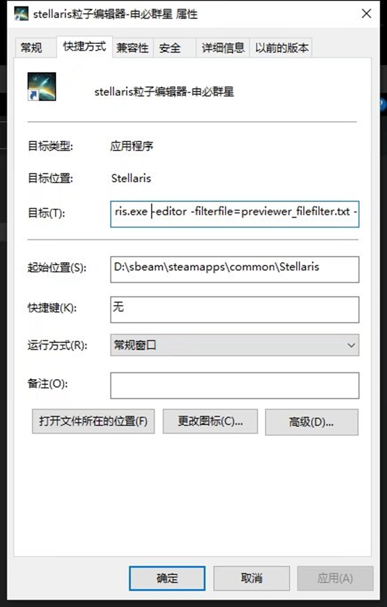
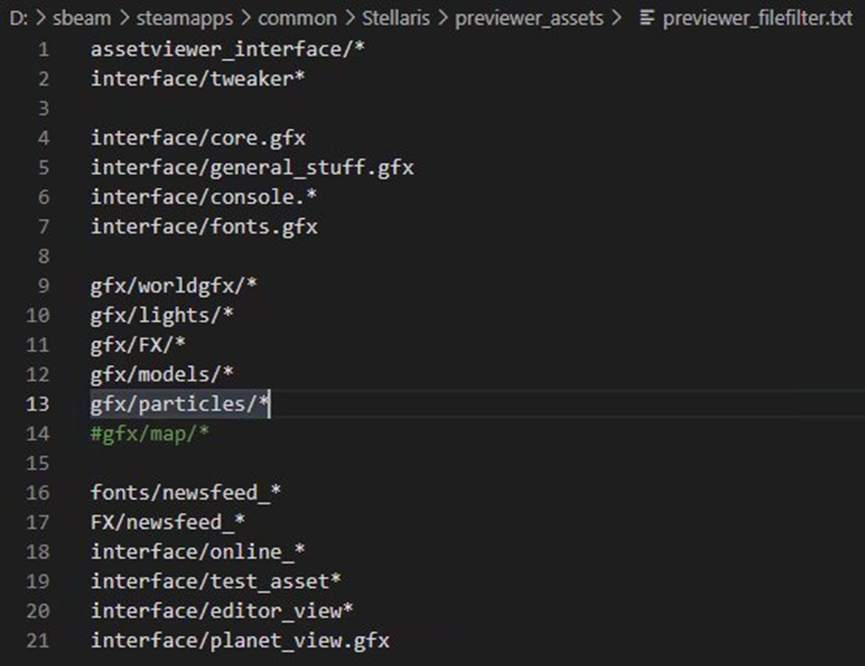
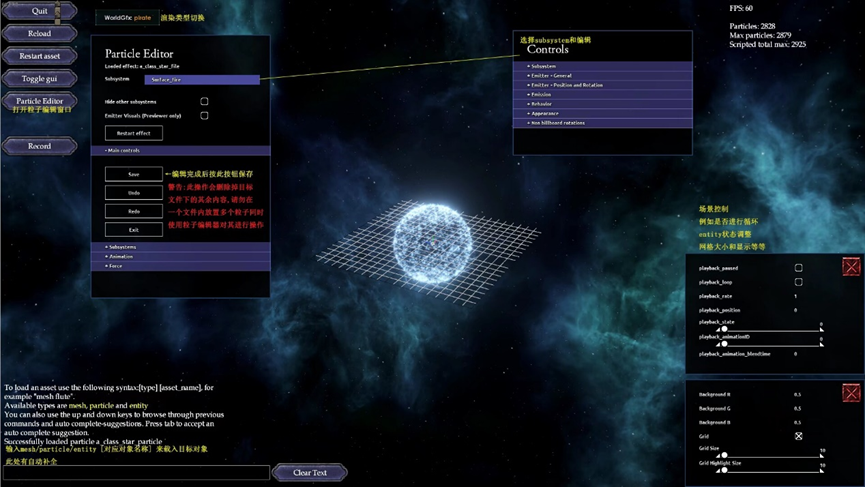

# 粒子编辑器配置

此篇教程仅讲述粒子编辑器的配置与基本使用,具体粒子编辑方式不进行教学。

首先,粒子编辑器并非一个独立的应用程序,而是包含在游戏主程序中的一个分支程序（这么说应该不严谨,不过明白意思就行）。

为了使用粒子编辑器，首先需要找到 `Stellaris.exe` 程序位置（不是 STEAM 创建的桌面图标）右键复制，并于任意位置**粘贴快捷方式**，然后右键此快捷方式，选择属性，在**目标**处的路径后面添加：

```text
-editor -filterfile=previewer_filefilter.txt -mount="C:\Users\admin\Documents\Paradox Interactive\Stellaris\mod\<你 MOD 的根文件夹>"
```

注意每个 `-` 之间都有且仅有一个空格，其余位置没有空格。

如果你的 Mod 文件夹位于其他位置，`-mount`处的路径也需要作出相应修改来指向正确位置。



随后,前往 `Stellaris\previewer_assets` 文件夹内，打开`previewer_filefilter.txt`，将文件内的几个注释符 `#` 删除（P社默认注释了它们，不知为何）。



然后就可以打开粒子编辑器并使用了,部分重要按钮参考下图：



:::note

有时候加载 Mod 粒子后试图打开编辑器窗口会直接崩溃，此时可以先打开一个原版粒子，打开窗口，再加载 Mod 粒子。或是打开 Mod 粒子,再打开原版粒子，打开编辑器，再通过左上角PREV切换上一个粒子。

:::
