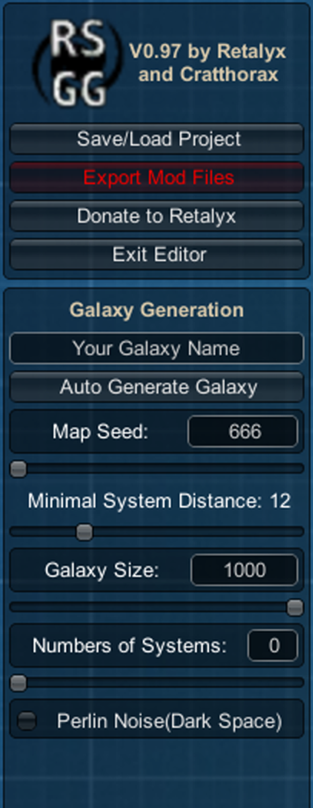
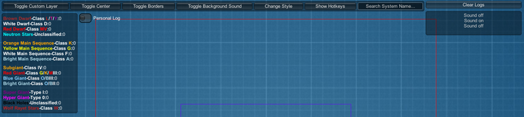
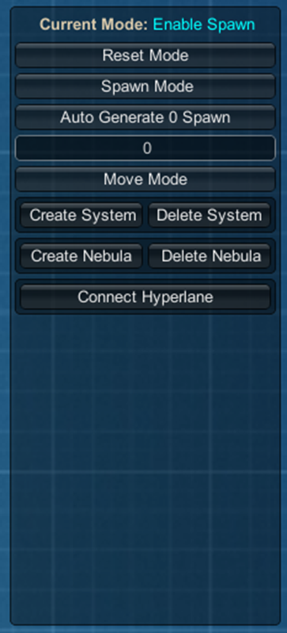
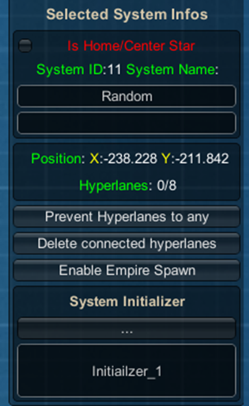
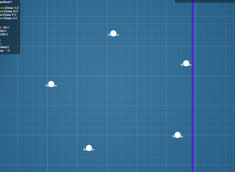
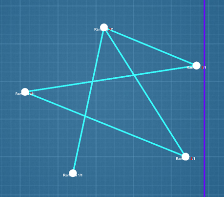
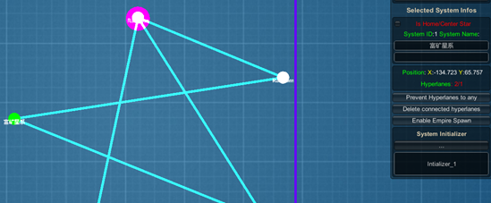

银河地图编辑器是一款第三方小工具，可用于辅助制作静态银河地图。
当然，他界面是英文的，不过理解用法并不算非常困难。

## UI 元素简介

### 左侧选项栏

<div style="display: flex; flex-direction: row; align-items: flex-start; gap: 2%; margin-bottom: 16px;">
<div style="margin-right: 2%;">



</div>
<div style="max-width: 70%; min-width: 50%;">

- Save/Load Project: 保存或加载一个用于该程序的存档，可随时读取再编辑。
- Export Mod Files: 完成编辑后使用此按钮生成一个用于群星的MOD文件
- Donate to Retalyx: 该软件作者的捐赠链接
- Exit Editor: 顾名思义，关闭编辑器

- Galaxy Generation: 这块是随机生成星系的选项
- \<Name\> 名字当然就是名字了
- Minimal system distance: 随机生成的星系最小间隔距离
- Galaxy size: 顾名思义，银河大小，不能大于半径 500（即 1000）
- Numbers of systems: 随机生成多少个星系
- Perlin Noise: 微调噪声生成器的选项。

</div>
</div>

若需要随机散布，设定好选项后点“Auto Generate Galaxy“进行随机生成
若不需要，这里只需要填个名字，然后看后面的内容。

### 顶部选项栏



顶部按钮，从左到右：
-   [切换背景图显示]：给编辑界面叠加一个背景图。
    读取 images 文件夹下的 `imageBackground01.png`，图像分辨率 2048*2048。
    若有一个预先设计好的背景图片，在放置星系时会方便定位很多。
-   [切换星系中心] 即编辑界面的黑圆，这指示了银河核心的大概范围
-   [切换边框] 即方形边框 红色是最大可用范围 蓝色是可用范围的一半位置。
-   [开关背景音乐] 切换这个软件的背景音乐
-   [改变风格] 切换这个软件UI的风格，建议默认，其他大部分都挺辣眼睛
-   [显示快捷键] 显示这个软件的快捷键操作提示


### 右侧选项栏
、
最重要的一部分。

<div style="display: flex; flex-direction: row; align-items: flex-start; gap: 2%; margin-bottom: 16px;">
<div style="margin-right: 2%;">



</div>
<div style="max-width: 70%; min-width: 50%;">

-   [Reset Mode] 清除当前的选择模式。转换为”选择模式”
-   [Spawn Mode] 选择生成位置模式，这个指的是玩家和 AI 可能作为出生位置的地方，
    使用该模式选定一个星系即可指定其为出生地。或用 [Auto Generate X spawn] 随机指定出生点。
-   [Move Mode] 移动编辑器内的元素，移动方式是按住不放并拖动
-   [Create system] [Delete system] 创建和删除星系
-   [Create nebula] [Delete nebula] 创建和删除星云
    注意：已放置的星云有时会无法选中，谨慎操作，善用保存
-   [Connect Hyperlane] 创建航道。
    选择该模式后，左键点击星系 A，再点击星系 B，即可在 AB 之间创建航道。
    也可利用该功能的随机系统随机为当前已放置星系生成随机航道。

</div>
</div>

### 星系信息面板

选择一个星系时会有这些选项。

<div style="display: flex; flex-direction: row; align-items: flex-start; gap: 2%; margin-bottom: 16px;">
<div style="margin-right: 2%;">



</div>
<div style="max-width: 70%; min-width: 50%;">

-   [is Home/Center Star] 不明
-   System ID 是在代码上这个星系的 ID，若需要在文档内精确查找可以找这个 ID
-   System Name 是这个星系的代码名 生成在最终的文件中，可直接显示，或被本地化文件作为本地化 key.
-   Position: 位置，也会被生成于输出后的文件中
-   Hyperlanes: 超空间航道数量，左侧数字为当前连接数，实际上不存在上限所以右侧数字不重要。
-   [prevent Hyperlanes to any] 这是个切换模式的按钮，切换阻挡/允许航道连接。
    似乎是用于控制自动生成航道时的行为，多次切换此模式会清除该星系已连接的航道。谨慎操作。
-   [delete connected hyperlanes] 删除航道，会删除与该星系相连的所有航道
-   [Enable Empire Spawn] 作为/不作为为帝国生成位置 属于生成位置的星系会有一个品红色圆圈背景。
-   [System Intializer] 星系预设，三个点是一些内置的预设。
    预设名称可以在 `presets.json` 中修改，也可在下面的输入框手动输入，默认为空，即随机。
    （似乎存在问题，不能正确在导出文件中生成）


</div>
</div>

## 如何进行一个静态星系的编辑

1.  （可选）替换文件中的背景图，以作为参考。
    若需要控制星系预设，编辑 `presets.json` 文件中的 `sys_init` 部分
2.  在界面中放置星系
    

    :::note[提示]

    滚轮缩放、方向键平移。
    不过这程序似乎没有限制帧数，且没有分离渲染帧和逻辑帧，导致平移速度异常的快。

    :::
3.  创建航道连接，使用航道工具左键星系A，再左键星系B即可创建，注意，该程序没有阻止生成完全相同航道的行为，
    因此请注意是否有重复生成航道
    
4.  使用 [Spawn Mode] 或星系选项指定至少一个帝国生成位置，以及若有需要，重命名这些星系并指定星系预设
    
5.  所有条件都符合时，界面左上角 [Export Mod Files] 会变绿并可按下，输出为可用的 MOD 文件
6.  在编辑器所在位置会出现一个 `GeneratedMods` 文件夹 里面有刚刚编辑器输出的文件，
    在 `GeneratedMods\[你刚刚导出的银河名称]\map\setup_scenarios\retalyx_[银河名称].txt` 中，
    还需要进行一些后续操作：

```pdx {8-13} "name = "Random"" del="initializer = retalyx_random_spawn"
# retalyx_test.txt

# Made with Retalyx Static Galaxy Generator v0.97
static_galaxy_scenario = {
    name = "TEST_galaxy"
    default = no
    priority = 0
    num_empires = { min = 1 max = 1 }
    num_empire_default = 1
    marauder_empire_default = 1
    marauder_empire_max = 4
    fallen_empire_max = 4
    advanced_empire_default = 1
    core_radius = 0
    primitive_odds = 1
    crisis_strength = 1
    random_hyperlanes = no
    num_wormhole_pairs = { min = 1 max = 30 }
    num_wormhole_pairs_default = 1
    num_gateways = { min = 1 max = 20 }
    num_gateways_default = 1
    random_hyperlanes = no

    system = { id = "0" name = "Random" position = { x = -185.3112 y = 24.45286 } initializer = retalyx_random_spawn spawn_weight = { base = 1 } }
    system = { id = "1" name = "富矿星系" position = { x = -134.7234 y = 65.75729 } }
    system = { id = "2" name = "Random" position = { x = -165.4173 y = 117.861 } }
    system = { id = "3" name = "Random" position = { x = -244.6154 y = 48.89447 } }
    system = { id = "4" name = "Random" position = { x = -237.6052 y = 107.2509 } initializer = retalyx_random_spawn spawn_weight = { base = 1 } }

    add_hyperlane = { from = "0" to = "1" }
    add_hyperlane = { from = "4" to = "0" }
    add_hyperlane = { from = "3" to = "1" }
    add_hyperlane = { from = "2" to = "0" }
    add_hyperlane = { from = "4" to = "1" }
}
```

顶部有一堆控制星系生成属性的值，其中,确保 `empires` 的数量不会大于星系可用生成位置的数量。

程序会自动为出生点星系创建一个预设，删除它，出生地星系不能有星系预设。
`spawn_weight` 即为作为出生地的权重值，权重相同时，0号玩家总是会生成在 ID 最小的可生成星系处。
由于该程序的星系预设导出似乎存在问题，若需要指定星系预设 就手动添加上 `initializer = [预设key值]`，
因此也务必在编辑器内为星系命名来便于识别。

`name = "Random"` 也会使这些星系真的被叫做 `Random`。因此如果不想要这种，删除所有 `name = "Random"`

星系预设建议自己制作命名一批，然后在 `common\solar_system_initializers` 文件夹下
编写对应的星系预设，可实现星系内容完全控制，或也可调用原版已有的星系预设，没有指定预设的星系会随机生成内容。

静态地图若需要一种对称结构，也可只制作一个单元，然后用一些坐标变换的码来复制剩余的部分。
输入坐标转换的 `effect: coordinate_transform`，
那么在下一个坐标转换代码之前的星系坐标都将会根据代码乘上相应的数值。

常见的坐标转换使用方法有：

<style>
    .container {
        width: 100%;
    }
    .row {
        display: grid;
        grid-template-columns: auto 1fr;
        align-items: start;
        gap: 8px;
        width: 100%
    }
    .label {
        margin-top: 1rem;
        white-space: nowrap;
    }
</style>
<div class="container">
<div class="row">
<div class="label">左右翻转</div>
<div class="cell">

```pdx showLineNumbers=false
coordinate_transform = {
    x = { mul = -1 }
}
```

</div>
</div>
<div class="row">
<div class="label">上下翻转</div>
<div class="cell">

```pdx showLineNumbers=false
coordinate_transform = {
    y = { mul = -1 }
}
```

</div>
</div>
<div class="row">
<div class="label">中心翻转</div>
<div class="cell">

```pdx showLineNumbers=false
coordinate_transform = {
    x = { mul = -1 }
    y = { mul = -1 }
}
```

</div>
</div>
</div>

因此，我们可以将代码额外复制 3 次，后三部分单元分别令 x 乘 -1、y 乘 -1、x 与 y 都乘 -1 来制作一个
四分的中心对称的地图。
此外，除了坐标轴对称与中心对称，通过交换 x 与 y 两个坐标轴的数值
可以得到沿 y=x 对称的部分，配合轴对称与中心对称可以利用其制作 8 分的对称地图；
或是拼凑、复制转换不同大小的星系单元来制作更复杂的结构，如 12 分地图。

如果想要减轻编写工作量，增加代码可读性，有 mod 基础的作者可以尝试利用传参机制编写 `inline_scripts`，如下例：

```pdx
inline_script = {
    script = map/NPVP1_1
    SEQ = F
    X = x
    Y = y
    ENC = guardians_artist_init_03
}
```

特别注意，要理清坐标转换之后各单元星系所在的位置，避免星系之间的连接航道发生错误。

完成所有工作后，只需要带走 `map\setup_scenarios\retalyx_[星系名称].txt` 文件(当然，可自由命名该文件名称)，
然后带去用于联机的 MOD 中的对应位置。
若也有星系预设文件，也得放在最终联机使用的 MOD 文件中（这软件自动生成的没必要留）。
