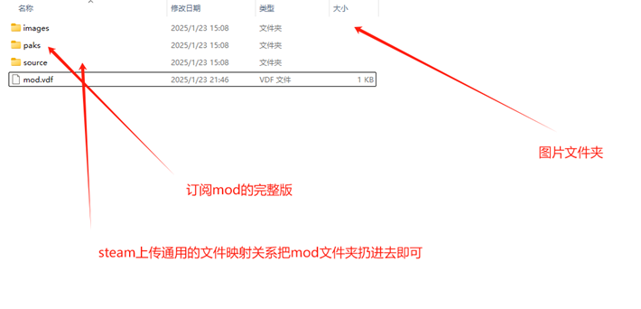
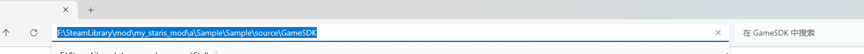
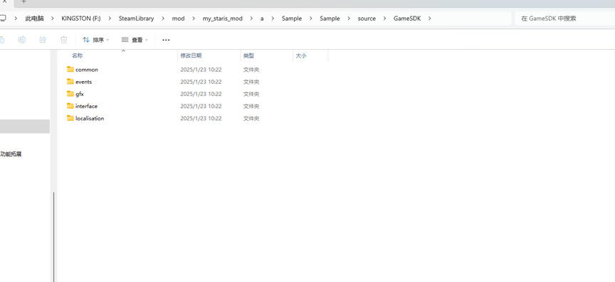

## 1. 下载并安装 Steam CMD

Steam CMD 官网：[SteamCMD - Valve Developer Community](https://developer.valvesoftware.com/wiki/SteamCMD)。

下载链接（Windows）：<https://steamcdn-a.akamaihd.net/client/installer/steamcmd.zip>

下载后解压到某个文件夹中即可完成安装。

:::caution

解压后的文件所在路径不能有中文

:::

## 2. 准备 Mod 文件

1.  将你的 MOD 文件整理到一个单独的文件夹中，例如 `C:\StellarisMod`；
2.  确保 MOD 文件夹中包含所有必要的文件和子文件夹。







## 3. 创建 Steam CMD Mod 配置文件

1.  在 MOD 文件夹中创建一个名为 `mod.vdf` 的文件，用于描述 mod 的基本信息；
2.  使用文本编辑器编辑该文件，内容如下：

    ```vdf
    "workshopitem"
    {
        "appid" "281990" // 群星的 Steam APPID
        "contentfolder" "C:\\StellarisMod" // MOD 文件夹的路径
        "previewfile" "C:\\StellarisMod\\thumbnail.jpg" // MOD 封面图片路径
        "title" "你的 MOD 名称"
        "description" "你的 MOD 描述"
        "changenote" "更新说明"
        "visibility" "0" // 0 - 公开，1 - 仅限好友，2 - 私密
        "publishedfield" "000" // 工坊物品 ID，自动生成，不需要手动填写
        "tags"
        {
            "0" "标签1"
            "1" "标签2"
        }
    }
    ```

3.  示例：

    ```vdf
    "workshopitem"
    {
        "appid" "281990"
        "contentfolder" "F:\SteamLibrary\mod\my_stallaris_mod\a\Sample\Sample\paks"
        "previewfile" "F:\SteamLibrary\mod\my_stallaris_mod\a\Sample\Sample\images\1.png"
        "visibility" "0"
        "title" "二段宇宙创生"
        "description" "描述"
        "changenote" "Initial release"
        "publishedfield" "3412937963"
    }
    ```

## 4. 上传 Mod

### 4.1 启动 Steam CMD

1.  打开命令提示符（CMD）或者 PowerShell；
2.  切换到 SteamCMD 所在的文件夹：

    ```powershell
    cd D:\steamcmd
    ```

    或直接点击 `Steamcmd.exe`

## 4.2 登录 Steam 账号

在 Steam CMD 中输入以下命令登录你的 Steam 账号：

```powershell
login 用户名 密码
```

:::note

如果需要 Steam Guard 验证码，输入：

```powershell
set_steam_guard_code 验证码
```

:::

### 4.3 上传 MOD

输入以下命令上传 Mod:

```powershell
workshop_build_item C:\StellarisMod\mod.vdf
```

等待上传完成，成功后会显示：

```powershell
Success!
```

