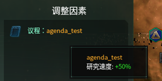
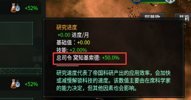
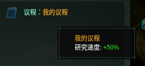
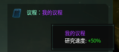

:::danger[重要提醒]

议程 (Agendas) 相关内容教程已过时，并非 stellaris v3.13+ 可用的格式，请移步法令 (edicts)，或科技 (technology) 学习注册你的第一个内容。--2025/2/26 

:::

## 认识议程的组成

先仿照 stellaris 文件夹的内容，创建一个 common 文件夹，之后里面再复制 stellaris 原文件的 agendas.txt，然后改名为 test_agendas.txt
之后删除里面的内容。

让我们先学习一下原版是怎么添加议程的：

```pdx
# 范围是引用具有此议程的领导者
agenda_naval_focus = {     # agenda_naval_focus指的是这个议程在游戏里面的ID
    weight_modifier = {    # 权重修正器，这个指这个议程能被刷出来的权重（概率）的修改
        weight = 100       # 基础值
        modifier = {
            from = {       # from = 国家，所以这里指的是国家拥有 `ethic_militarist` 时的修正
                has_ethic = ethic_militarist
            }
            factor = 1.5   # factor为乘法，即拥有 `ethic_militarist` 权重乘以1.5倍
        }
        modifier = {       # 同理，即拥有 `ethic_fanatic_militarist` 权重乘以2倍
            from = {
                has_ethic = ethic_fanatic_militarist
            }
            factor = 2
        }
        modifier = {       # `leader_class` 这里指的是担任帝国元首的领袖曾经的类别（将军什么的）
            factor = 1.5
            leader_class = admiral
        }
    }

    modifier = {           # 修正器，指对于这个帝国的修正(buff或者debuff)
        starbase_shipyard_build_cost_mult -= -0.10   # 太空基地船厂的造船建造花费-18%
        ships_upkeep_mult = -0.05                    # 舰队维护费-5%
        starbase_shipyard_build_speed_mult = 0.20    # 太空基地船厂的造船建造速度+20%
    }
}
```

从上面的例子，我们可以看得出，议程包括以下几个模块：

1. 议程的名称
2. 刷出的权重（包括对于权重的修改）
3. 修正器（国家的 buff 或者 debuff）

## 添加自己的第一个议程

在学习到了一个议程有怎么样的组成之后，现在让我们开始真正的动工，写下你的 mod 里面第一个内容——你的第一个议程。

值得注意的是，Stellaris 里面不论是什么项目的 ID，都应该是**唯一且确定**的，除非你是修改原版的议程，不然一定要确认原版是否已经使用了这个 ID，比如这次我们起一个“agenda_test”名称的，那么现在应该看起来是这样的（“#”后面的内容并不会被游戏所读取，所以一般用于添加注释）

```pdx
# 我的第一个议程
agenda_test = {
}
```

现在看起来空空如也，一点也不好看，那么我们仿照上面的例子，添加一个**权重**。

```pdx
agenda_test = {
    weight_modifier = {
        weight = 10000   # 一般情况下100为比较常见的数值，但是这里为了能让我们的议程效果被很容易地看见，所以写成了10000
    }
}
```

在添加了权重之后，自然是各位第四天灾喜闻乐见的 buff 环节，众所周知科技是第一生产力，那么这次我们就写一个**科学研究速度\***+50%\*的议程吧。

```pdx
agenda_test = {
    weight_modifier = {
        weight = 10000
    }
    modifier = {
        all_technology_research_speed = 0.50  # 帝国科研速度+50%
    }
}
```

好，到此我们保存我们的 mod 文件，效果应该如上图所示。之后我们需要打开一次 stellaris 来验证是否真正的在游戏里面被添加了这个 `agenda_test` 议程。启动游戏，加载我们的“test” MOD！之后随意开一局是**寡头政体**的国家。

当你发现你的议程是像图 8 那样显示的时候，那么恭喜你，你的 mod 被成功读取且还能正常显示了，不过没有显示的也不要灰心，开启控制台，刷影响力后刷选举，如果几次之后能看得见自己的议程，那么证明也是成功的。不过如果确实找不到，那么还请检查是否按照了上面的操作，或者是检查括号的位置，相信一定可以成功的。





不过对于这样强力的议程来说，我们一般不想要任何帝国都能刷到这个议程，这个时候就要对刷出这个议程的权重做出调整和某些限制，比如就拿这个议程而言，我们想要唯物（物质）主义才能获得，而其他思潮无法刷到，那么应该这样：（在这里 NOT 是取反语句，即当目标不符合括号里面的条件的时候成立）

```pdx
agenda_test = {
    weight_modifier = {
        weight = 10000
        modifier = {
            factor = 0    # factor为乘法，即当没有唯物主义或极端唯物主义时，权重乘以0倍
            from = {
                NOT = { has_ethic = ethic_materialist }          # 唯物主义思潮
                NOT = { has_ethic = ethic_fanatic_materialist }  # 极端唯物主义思潮
            }
        }
    }
    modifier = {
        all_technology_research_speed = 0.50
    }
}
```

当做好这些修改再进入游戏里面，你就会发现如果不选择唯物或者极端唯物，那么永远刷不出来这个议程——而带上了唯物之后，就会刷的出来（效果和之前一样）。这样便实现了我们所需要的判断，即拥有唯物主义或者极端唯物主义可以刷出这个议程，没有则无法刷出。同样的，如果没有实现这样的效果，请确保括号以及其他操作的正确。

## 本地化

```yaml
l_simp_chinese:
    agenda_test:0 "我的议程" # 这里的键名必须同你的议程名一致
```

保存，进入游戏。记得带唯物，不然不会刷出来（详见前面的第三章内容），如果操作无误，应该是下图的效果。



我们可以看见蠢驴很贴心的给我们的名称上了橙色，但是堂堂第四天灾的议程怎么能和普通的一样？所以再次打开刚刚的本地化文件改成：

```yaml
l_simp_chinese:
    agenda_test:0 "§M我的议程§!"
```

这样一来，打开游戏，就会显示出下图的效果，这样就显得与众不同了。当然根据上述所学的代码，还可以搞出一些很生动的本地化效果，不过现阶段就先讲述到此。

