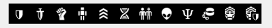
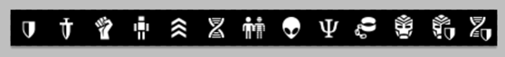
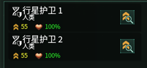

## 军队的组成与修改

军队文件存在于 `Stellaris\common\armies` 目录下，下面以一个实例用于了解军队的基本结构与内容，以及它的修改：

```pdx
# Clone Armies
clone_army = {          # ID
    # defensive = yes   # 是否是防御军队？
    # is_pop_spawned = yes   # 是否是由人口自动生成，一般用于防御部队（如果没有defensive = yes则会产生很奇怪的效果）
    damage = 1.00       # 伤害，一倍标准值是1.50-3.00，这里的数值都是其倍数，下同
    health = 1.00       # 生命值，一倍标准为200
    morale = 1.00       # 士气，一倍标准为200
    # morale_damage = 0.75      # 士气伤害，标准值为一倍
    collateral_damage = 1.25    # 附带伤害
    war_exhaustion = 0.50       # 厌战产生，一般防御部队为0
    time = 30           # 生产的基础天数
    icon_frame = 7      # 图标，具体图标在 `Stellaris\gfx\interface\planetview\army_icon.dds`
    pop_limited = no    # 是否有人口限制？一般都有人口限制（没有人口限制的都是异端！！！）
    resources = {       # 消耗的资源
        category = armies       # 类型：军队
        cost = {
            minerals = 75       # 具体资源以及其数目
        }
        upkeep = {
            energy = 0.75       # 每月的维护费
        }
    }
    prerequisites = { "tech_gene_banks" }       # 需要的前置科技
    show_tech_unlock_if = {     # 当满足什么情况时，显示科技可以解锁它
        OR = {
            NOT = { has_authority = auth_machine_intelligence }
            has_civic = civic_machine_assimilator
        }
    }
    potential = {       # 限制，不满足无法被看见。 `always = no` 代表永远无法建造
        from = {
            NOR = {
                has_trait = "trait_mechanical"
                has_trait = "trait_machine_unit"
                is_sapient = no
            }
            owner = {
                OR = {
                    NOT = { has_authority = auth_machine_intelligence }
                    has_civic = civic_machine_assimilator
                }
            }
        }
    }
}
```

军队相对简单，一般不需要图标，除非你想改 `Stellaris\gfx\interface\planetview\army_icon.dds` 的文件；需要本地化文本。不过最关键的是设置解锁其的科技或者其他条件或者判断这个军队是否可用的逻辑语句，保持基础的逻辑自治。<s>我相信你应该不会想让圣卫爆出来一堆机器人军队的...吧？（圣卫：MMP!!GUNA!!!）。</s>

## 军队图标的修改

不习惯原版的图标？想要自行发挥？当然可以，下面我们来自定义军队图标 `Stellaris\gfx\interface\planetview\army_icon.dds` 是图标的目录，你应该会看见如下的图：



打开它，编辑，注意：每一个小图标都是**34\*34**的像素，也就是说你的长度必须是34的整数倍，倘若不为34的整数倍，可能会造成无法成功被读取的结果。当你改动之后，记得写入阿尔法图层以实现透明效果。例如我改动之后：



这样一共有13个图标了（原版的12+1个我的），不过现在由于没有在 `Stellaris\interface\icons.gfx` 里面注册，新的图标是不会被读取的，这样我们需要打开 `icons.gfx` 里面，找到下面的语句：

```pdx
spriteType = {
    name = "GFX_army_icons"
    textureFile = "gfx/interface/planetview/army_icon.dds"
    noOfFrames = 12
}
```

:::note[提示]

这里所述的全部改动都应该在你的mod里面复制一份然后修改

:::

将其改成为：

```diff
spriteType = {
    name = "GFX_army_icons"
    textureFile = "gfx/interface/planetview/army_icon.dds"
-    noOfFrames = 12
+    noOfFrames = 13 # 现在是13个图标，自然填写13
}
```

这样进入游戏，应该会有下图的效果：



这样，一个新增加的图标的完成了。更多的图标也类似于上述的操作，不过一定要注意<font color="red"><b>长宽必须是34的整数倍！！！</b></font>
