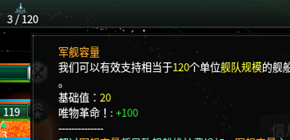
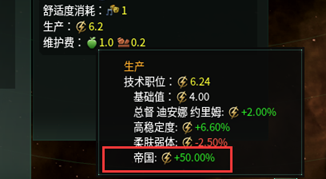
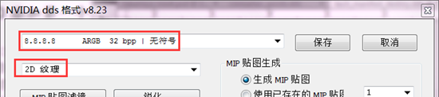

## 认识科技的组成

以原版的 `technology` 文件夹下的` 00_eng_tech.txt` 为例

```pdx
tech_corvettes = {       # 同样的， `tech_corvettes` 为ID，这个科技是初始的护卫舰科技
    cost = 0             # 这项科技的花费
    area = engineering   # 分类，指的是工程学（物理学/社会学/工程学）
    start_tech = yes     # 为初始科技，` = no` 就不是（不过一般非初始科技都不写这行）
    category = { voidcraft }       # 具体的分类，这里指的是太空飞船（灵能学/政治学/军事学等）
    prerequisites = { "tech_starbase_2" }   # 前置科技，当没有研究前置科技之前，无法刷到本科技
    tier = 0             # 是多少级的科技？这里写的是0级科技。一个n级科技需要最少6项(n-1)级科技的研究完成，才会被刷出来
    prereqfor_desc = {   # 提示文本，例如“这项科技可以带给我们xxx领域的进步”等
        ship = {
            title = "TECH_UNLOCK_CORVETTE_CONSTRUCTION_TITLE"   # 文本标题
            desc = "TECH_UNLOCK_CORVETTE_CONSTRUCTION_DESC"     # 内容
        }
    }
}

tech_destroyers = {      # 同样的， `tech_destroyers` 为ID，这个科技是驱逐舰科技
    cost = @tier2cost1   # `@` 指引用数值， `common\scripted_variables` 目录下里面有详细数值，本项为2000
    area = engineering   # 分类：工程学
    tier = 2             # 是2级科技
    category = { voidcraft }    # 具体分类：太空飞船
    prerequisites = { "tech_corvettes" }    # 前置科技：护卫舰
    weight = @tier2weight1      # 引用数值，为85

    gateway = ship       # 指通向舰船科技的大门（据说可以提升权重，但目前而言看起来似乎没什么效果，待补充）
    ## unlock destroyer
    prereqfor_desc = {   # 文本
        ship = {
            title = "TECH_UNLOCK_DESTROYER_CONSTRUCTION_TITLE"
            desc = "TECH_UNLOCK_DESTROYER_CONSTRUCTION_DESC"
        }
    }
    modifier = {         # 修正器，这里的修正范围是整个帝国
        country_command_limit_add = 10      # 舰队控制上限+10
    }
    weight_modifier = {  # 权重修改器，在符合条件的时候，改变刷新权重
        modifier = {
            factor = 0.1
            NOT = { years_passed > 10 }     # 当开局没超过10年，权重乘以0.1
        }
        modifier = {
            factor = 10
            any_neighbor_country = {
                has_technology = tech_destroyers # 拥有护卫舰科技权重乘以10
            }
        }
        modifier = {
            factor = 2
            years_passed > 15       # 开局超过15年，权重乘以2
        }
        modifier = {
            factor = 3
            years_passed > 20       # 开局超过15年，权重乘以3
        }
        modifier = {
            factor = 4
            years_passed > 30       # 开局超过15年，权重乘以4
        }
        modifier = {
            factor = 1.25
            has_tradition = tr_supremacy_adopt      # 树立霸权传统，则权重乘以1.25
        }
        modifier = {
            factor = 1.25
            research_leader = {     # 当工程学科研的领导科学家拥有太空飞船专长特质时，权重乘1.25
                area = engineering
                has_trait = "leader_trait_expertise_voidcraft"
            }
        }
    }
    ai_weight = {                   # AI的选取权重，如果设置为0则AI永远不会研究它
        factor = 100 #important tech
        modifier = {
            factor = 1.25
            research_leader = {     # 当工程学科研的领导科学家拥有太空飞船专长特质时，权重乘1.25
                area = engineering
                has_trait = "leader_trait_expertise_voidcraft"
            }
        }
    }
}
```

从上面的例子，我们可以看得出，科技应该包括以下几个模块：

1. 科技的名称，花费，等级，类别，种类等
2. 刷出的权重以及其修改
3. 修正器(modifier)（国家的 buff 或者 debuff）
4. AI 的使用权重以及其修改
5. 其他的杂项

## 修改（创造）新科技

同样的，将 `technology` 文件夹下的全部内容删除，保留一个 txt 并删除其之中内容，重命名为` 00_test_tech.txt` 。这次演示做一个科技，效果是“来自工作产生的能量+50%和舰队容量+100”，类似第三章的操作，完成如下的操作：

```pdx
tech_test = {
    cost = @tier2cost3      # `@` 指引用数值
    area = society          # 社会学领域
    tier = 1
    category = { military_theory }  # 军事科技

    weight = 10000          # 一般情况下100为比较常见的数值，但是这里为了能我们的议程效果被很容易的看见，所以写成了10000
    prereqfor_desc = {      # 文本
        ship = {
            title = "TECH_MY_TEST_TITLE"
            desc = "TECH_MY_TEST_DESC"
        }
    }

    weight_modifier = {
        modifier = {        # 这里的默认范围是帝国，所以不需要表示范围的语句（例如from/owner等）
            factor = 0      # factor为乘法，即当没有唯物主义或者极端唯物主义时，权重乘以0倍
                NOR = {
                has_ethic = ethic_materialist           # ethic_materialist唯物主义思潮
                has_ethic = ethic_fanatic_materialist   # ethic_materialist极端唯物主义思潮
            }
        }
    }
    modifier = {
        planet_jobs_energy_produces_mult = 0.50  # 来自职业的能源产出+50%
        country_naval_cap_add = 100              # 舰队容量+100
    }
    ai_weight = {
        factor = 0
    }
}
```

和议程一样，没有本地化文本一样无法显示我们想要的内容，仿照第四章的做法，我们在我们的本地化文件之中加上以下的内容：

```yaml
l_simp_chinese:
    # 下面两项为Stellaris默认读取的关于科技的本地化，必须保持这个格式
    tech_test:0 "唯物革命！"    # 这里的键值跟科技的名称保持一致
    tech_test_desc:0 "呵呵哈哈哈蛤蛤！我们是睿智的唯物主义！"  # `_desc` 后缀代表这一项配置的是这个科技的说明和描述
    # 下面两项是我们在上面的科技中设定的标识，可以修改，但是我们一般对于 `title` 和 `desc` 保持这个格式
    TECH_MY_TEST_TITLE:0 "这是唯物革命！"
    TECH_MY_TEST_DESC:0 "唯物革命能极大的提升我国实力！！！"
```

进入游戏，惯例是唯物，应该会看见以下的内容。






## 添加图标

在添加自己的图标之前，先来看看蠢驴的图标都放到哪里： `Stellaris\gfx\interface\icons\technologies` 这里面都是原版 stellaris 的科技图标，如果你只是想简单的套用蠢驴的图标，那么很简单，只要在刚刚的写的科技里面加上这样一句 `icon = [科技图标名称]` 例如 `icon = tech_manifest_destiny` ，那么就完成了。

不过如果你想要自己添加一个独一无二的图标，那么就得编辑.dds 文件了。Photoshop 有能修改.dds 文件的插件，本教程不提供 PS 极其插件的下载链接。在此我先默认大家都有这样的条件。同样的，仿照 stellaris 的科技图标目录建立文件夹，之后只留下一个 `tech_manifest_destiny.dds` 文件，用 PS 打开之后根据自己的喜好修改（本教程不提供 PS 方面的教程，还请见谅）比如我的就像是图 1 那样，保存时应该按照图 2 那样设置，这样可以使得你的贴图拥有最高的质量，不易发生失真，保存名字应该与科技同名，这样方便之后查询以及调用。


<p align="center"><small>图1</small></p>



<p align="center"><small>图2</small></p>

进入查看效果，我的效果是这样，红框应该显示了你修改之后的图标，倘若存在错误，那么请检查是不是正确的引用了这个图标。如果你想要科技看起来是稀有科技或者危险科技，只需要在刚刚的科技里面打上 `is_rare = yes` （是稀有科技）或者 `is_dangerous = yes` （是危险科技）那么对于科技的简易修改，就先到这里了。


