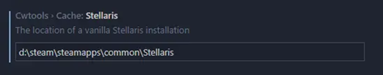
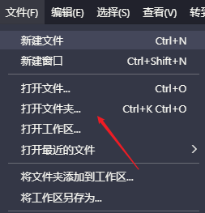
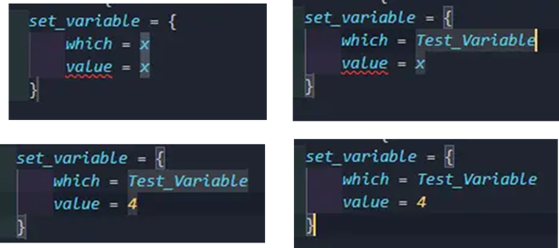
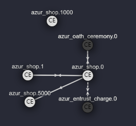
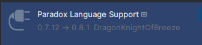
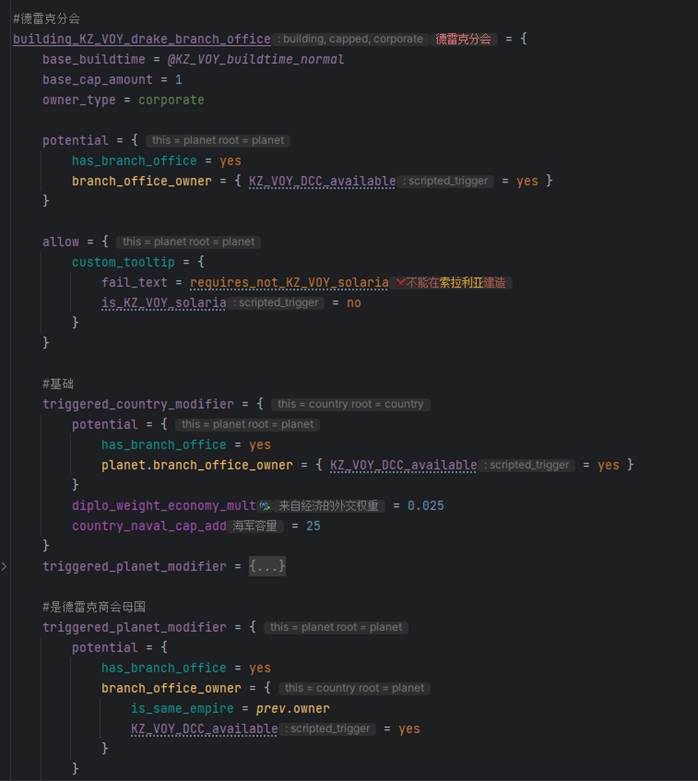
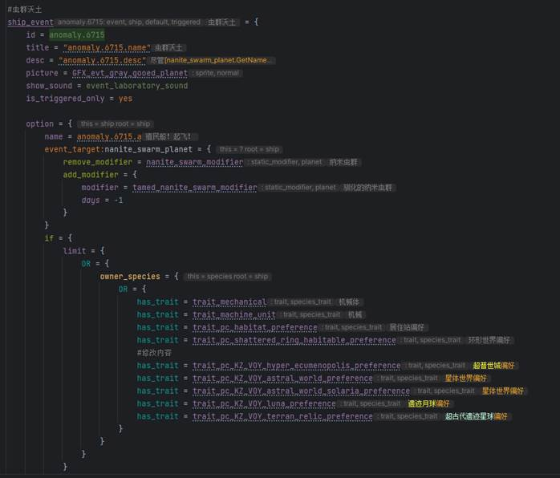
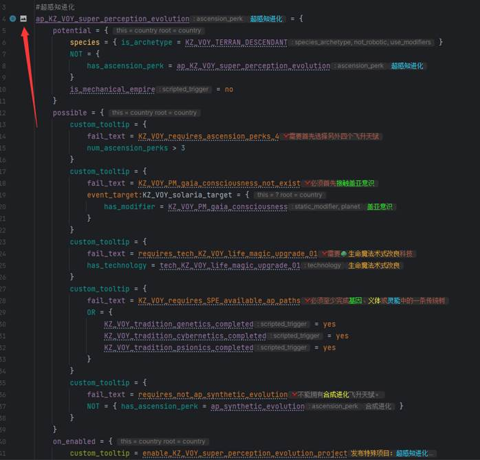
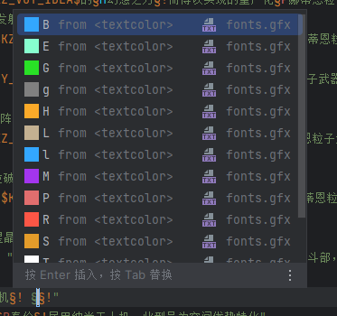

## 编辑器选择

工欲善其事，必先利其器。由于蠢驴的大部分 Mod 文件都是.txt 文件，因此各位在之前的 Mod 制作过程中，应该已经选择了自己熟悉的文本编辑器进行 Mod 制作。但是到了 Event 部分，我个人十分建议采用 VSC(Visual Studio Code)或 Idea(Jetbrains IntelliJ Idea)|PyCharm(Jetbrains PyCharm)进行 Mod 编写。

-   Vsc 官网：https://code.visualstudio.com/
-   Idea 官网：https://www.jetbrains.com.cn/idea/ （选择 Community 社区版足够编写 MOD 使用，不需要购买标准版）
-   PyCharm 官网：https://www.jetbrains.com.cn/pycharm/ （选择 Community 社区版足够编写 MOD 使用，不需要购买标准版）

如果你选择 VS Code 作为你的编辑器，请前往[CWTools](#cwtoolsvscode)安装插件。

如果你选择 Idea 或 PyCharm 或 Jetbrains 的任意一款 IDE 作为你的编辑器，请前往[PLS](#paradox-language-supportpls-jetbrains-ide)安装插件。

## CWTools(VsCode)

### CWTools 插件安装与配置

在 VSC 中有一个蠢驴全家桶插件，功能较为完善。该插件支持错误提示，自动补齐，生成科技树、事件树，一键生成本地化 Key 等等一系列功能。在编写 Event 的时候还能够查看每个 Event 的引用情况（包括 Scripted Effect 的内容），作用域等等功能，方便我们编写 Event（该插件有点吃内存）。

该插件还自带了一个语法高亮，不过配色有点花哨，建议配合其他主题组合使用。

插件安装使用：

1. 拓展中搜索 CWTools，点击安装
2. 右键安装的 CWTolls，点击拓展设置
3. 将群星(Stellaris)的根目录路径复制到 Stellaris 一栏中



4. 重启 VSC，通过 VSC 打开文件夹，插件将会自动加载。

注意，此 mod 必须在默认文件夹当中，也就是路径为 `Paradox Interactive\Stellaris\mod` 下才能生效，并且请用文件夹形式打开你 mod 的根目录：



这样就将你所有 mod 内容全部加载入 CWT。

### CWTools 插件使用

#### 一、自动补全

当输入一个字符之时将会进行模糊搜索检测该范围内可用的语句（这个检测仅限于区别 Condition 和 Effect，不包括 Scope 匹配）当我们不断输入字符时，如果默认光标已经移动到我们需要的语句之上时，按下 Tap 键可以进行补齐，如若我们需要切换默认光标位置，按下小键盘上的上下按键可以调整光标位置。如果该语句存在固定格式，则会自动生成代码块（如 if，switch，各种变量操作语句等），这里以 set_variable 为例（关于变量(Variable)操作我会在之后详细介绍，这里仅仅是为了展示 VSC 生成代码块的一些功能，不必理会有何用途），当你使用 Tap 键入 set_variable 时，将会自动生成标准格式，包括一个“which”以及一个“value”属性。此时你会发现后面两个预设的 x 上都有一层阴影，现在直接输入一个字符，你会发现 x 自动被清除了，留下的是你输入的字符，这里示例为 Test_Variable。

输入完毕之后，如果细心还会发现刚才输入的字符串似乎和之前一样也有阴影，此时再按下 Tap，光标位置已经移动到了 value 后方的 x 上，此时再输入一个数字 4。再次按下 Tap，光标又跳转到了 set_variable 语句最后的花括号外。（某些参数跳转用起来并不舒服，不过既然有这功能就此介绍一下），这种输入方式在许多 IDE 中都存在，差不多是预设参数快速跳转输入，能够方便我们快速跳转输入参数完成语句书写，如若能够熟练掌握，写代码的速度将会提高。



#### 二、查看引用

有时候我们需要知道文件中有哪些地方调用了我们的 Event，此时我们按住 Ctrl 并将鼠标移动到 Event 的类型上方就会发现类型变成了一个可以点击的类似于选项的按钮，并且颜色发生变化，此时点击便会出现所有引用并标出文件位置，统计引用次数以及哪个语句引用，并且可以点击跳转对应文件。如若我们想查找我们引用的 Event 在哪里定义的，则也可以按住 Ctrl 然后用鼠标左键点击引用的 Event 的 id 然后会直接跳转到对应 Event 的定义。

```pdx
azur_expand_dispose_leader_cost = {
    ENERGY = 500
    NUM = 1
    NEXT_ENERGY_COST = 2000
}
```

上方列举的封装效果(Scripted Effect)也可采用上述方法进行定义以及引用跳转。

#### 三、代码风格

每个人写代码都有自己的风格，比如有些人写语句喜欢一行写完简单语句：

```pdx
set_variable = { which = x value = x }
```

这样的确可以减少行数的变换，不过会造成可读性的降低，在写简单语句之时可以使用，一旦书写较为复杂的逻辑之时，就会使得代码几乎没有可读性，十分难以维护，并且上述写法无法使用 VSC 生成的代码块。如果各位刚刚学习 Event，我更倾向于采用可读性更高的写法，将每个属性以及逻辑门都一一列出来，这样每个属性以及各个语句之间的关系便显现出来了，但这只是一个小的方面，风格还包括喜欢用哪些语句进行书写功能，实现各种功能的方法有很多，在自己的学习过程中能够写出自己的风格也是养成习惯的一种方式（意思是自己写的代码自己得看的下去）。

注意以下代码的缩进格式，虽然 VSC 会进行自动缩进辅助，但是这个功能时好时坏，因此请务必保持良好的缩进习惯！（拿记事本写 Mod 的可以鲨了）<kbd>Shif</kbd>+<kbd>Alt</kbd>+<kdb>F</kbd>就可以进行当前文件的代码格式化。

```pdx
planet_event = {
    id = azur_planet_attack.2
    is_triggered_only = yes
    hide_window = yes

    immediate = {
        change_pc = pc_black_hole
        solar_system = {
            every_system_planet = {
                limit = {
                    is_star = no
                }
                every_system_megastructure = {
                    delete_megastructure = this
                }
                if = {
                    limit = {
                        NOR = {
                            is_planet_class = pc_frozen
                            is_planet_class = pc_gas_giant
                        }
                    }
                    change_pc = pc_frozen
                }
            }
            every_fleet_in_system = {
                limit = {
                    NOT = {
                        is_ship_class = shipclass_colonizer
                    }
                }
                destroy_fleet = this
            }
        }
    }
}
```

:::caution[工具]

CWTools 提供的格式化模式是会清除一切空行，会使得某些部分紧缩成一团造成可读性稍微的下降，除非实在没有办法要处理大规模不规范代码，不建议格式化代码。

:::

#### 四、批量注释

有时候我们调试某个 Event 之时，某些 Effect 我们需要逐个进行排查，而我们又不想删除之前写的代码，因此暂时的注释掉是最好的选择，抑或是某些功能写出来却不想启用，就先注释掉以备后用。注释掉比不进行调用更加节省加载时间并能稍微提高那么一点点性能，前者根本不会被编译，后者还是会进行编译并占用空间。而我们需要注释的地方可能比较的多，那么我们需要进行批量注释，批量注释方法十分简单，框选你需要注释的代码，按下<kbd>Ctrl</kbd>+<kbd>K</kbd>+<kbd>C</kbd>（按住<kbd>Ctrl</kbd>，然后一次按下<kbd>K</kbd>和<kbd>C</kbd>），即可完成批量注释，那么对应的需要解除注释，我们可以框选所需代码，按下 <kbd>Ctrl</kbd>+<kbd>K</kbd>+<kbd>U</kbd> 即可解除注释（批量注释原理就是往选择的语句前边都加一个#，因此可以多次添加，但没意义）。 以上仅仅是介绍了一些常用方法，其中大部分的快捷键都是编程所经常用到的，常用的还有：复制当前行到下一行 <kbd>Alt</kbd>+<kbd>Shift</kbd>+<kbd>Down</kbd>，快速跳转行末：<kbd>End</kbd>，快速跳转行首：<kbd>Home</kbd> 等等。你可以自行设置这些快捷键（如何设置请自行百度），熟练使用这些快捷键将会极大的提升你的代码书写速度，并写出较为美观的代码。

#### 五、额外功能

CWT 还提供了其他一些聊胜于无的功能，比如根据前置科技生成科技树，根据事件链（Event 相互触发）生成事件树，当我们当前文件为 `event` 或者 `technology` 之时，文件上方标题最右方将会有一个 `Show graph` 的按钮，点击之后将会自动生成当前文件所有事件之间的相关性。


如下示例：

> 以下示例来自工坊 id 1617872589，AzurLane Stellaris DLC

```pdx
namespace = azur_shop

country_event = {
    id = azur_shop.0
    is_triggered_only = yes
    title = azur_shop.0.name
    desc = azur_shop.0.desc
    diplomatic = yes
    picture_event_data = {
        portrait = root.ruler
        room = azur_office_room
    }
    trigger = {
        from = {
            is_country_type = azur_research
        }
        azurlane_default_govement_trigger = yes
    }
    immediate = {
        set_country_flag = azur_shop
    }
    option = {  # 研发部
        name = azur_shop.0.aa
        country_event = {
            id = azur_shop.1

        }
    }
    option = {  # 誓约
        name = azur_shop.0.bb
        allow = {
            if = {
                limit = {
                    hidden_trigger = {
                        has_country_flag = oath_ceremony_begining
                    }
                }
                NOT = {
                    has_policy_flag = oath_ceremony_close
                }
            }
            else = {
                NOT = {
                    has_policy_flag = oath_ceremony_close
                }
                custom_tooltip = {
                    fail_text = lack_azur_rings
                    check_variable = {
                        which = azurlane_ring
                        value >= 1
                    }
                }
            }
        }
        hidden_effect = {
            country_event = {
                id = azur_oath_ceremony.0
            }
        }
    }
    option = {  # 偶像
        name = azur_shop.0.cc
        allow = {
            fail_text = {
                text = azur_idol_start_tooltip
                has_global_flag = azur_expand_μ_leader
            }
        }
        hidden_effect = {
            country_event = {
                id = azur_shop.5000
            }
        }
    }
    # option = {    # 委托
    #   name = azur_shop.0.dd
    #   trigger = {
    #       fail_text = {
    #           text = azur_entrust_charge_cooldown
    #           NOT = {
    #               has_country_flag = azur_entrust_charge_cooldown
    #           }
    #       }
    #   }
    #   hidden_effect = {
    #       country_event = {
    #           id = azur_entrust_charge.0
    #       }
    #   }
    # }
    option = {  # 退出
        name = azur_shop.0.00
        hidden_effect = {
            remove_country_flag = azur_shop
        }
        default_hide_option = yes
    }
}

country_event = {
    id = azur_shop.1
    is_triggered_only = yes
    title = azur_shop.1.name
    desc = azur_shop.1.desc
    diplomatic = yes
    picture_event_data = {
        portrait = root.ruler
        room = azur_laboratory_room
    }

    option = {  # 戒指
        name = azur_shop.1.aa
        custom_tooltip = azur_rings_cost
        allow = {
            has_resource = {
                type = energy
                amount >= 10000
            }
        }
        hidden_effect = {
            add_resource = {
                energy = -10000
            }
            change_variable = {
                which = azurlane_ring
                value = 1
            }
            country_event = {
                id = azur_shop.1
            }
        }
    }
    option = {  # 返回
        name = azur_shop.1.bb
        hidden_effect = {
            country_event = {
                id = azur_shop.0
            }
        }
        default_hide_option = yes
    }
}

country_event = {
    id = azur_shop.1000
    is_triggered_only = yes
    hide_window = yes

    trigger = {
        is_ai = no
        azurlane_default_govement_trigger = yes
    }

    immediate = {
        create_country = {
            name = "Name_central_office"
            type = azur_research
            flag = {
                icon = {
                    category = "azurlane_flags_sp"
                    file = "flag_K_logo.dds"
                }
                background= {
                    category="backgrounds"
                    file="00_solid.dds"
                }
                colors={
                    "black"
                    "black"
                    "null"
                    "null"
                }
            }
        }
        last_created_country = {
            establish_communications_no_message = root
        }
    }
}

country_event = {   # 引导
    id = azur_shop.5000
    is_triggered_only = yes
    hide_window = yes
    immediate = {
        country_event = {
            id = azur_expand_s.0
        }
    }
}
```

将会生成如下表：



在这张表的右上角将会出现如下按钮：


选择将表以何种形式导出。

科技也可以如此步骤导出，可以迅速生成一条简陋的科技树。

## Paradox Language Support/PLS (Jetbrains IDE)

### PLS 插件概述

由于对 CWTools 某些地方的不满，群中有一位大佬根据 CWTools 的规则文件并加以完善，移植到了 IDEA 上边，目前可以在插件库当中找到该插件（目前仅对 Stellaris 语法有完整支持，对蠢驴其他游戏的支持并不完整）：



该插件不仅有 CWTools 基础的语法补齐，还有许多独到的地方，如果能够接受使用 IDEA 这种正经 IDE 编写 mod 的话，该插件也是一个十分不错的选择，至少不会像 CWTools 隔山差五抽风无效，目前还支持最新的语法（CWTools 更新速度感人，截止我写下这篇介绍还有很多地方没支持最新的写法），并且由于作者就在 Modder 交流群当中，有什么建议可以直接反馈，因此接更新也会较为贴合各位 Modder 使用。接下来截图介绍一下我认为比较独特的地方，这里采用的示例 mod 为久远之旅（以下展示仅为冰山一角，如果感兴趣的话可以自行下载体验，目前一直在完善当中）：

### PLS 插件的使用

#### 一、实时预览本地化以及 Scope 解析





#### 二、条目图标预览



点击即可跳转至对应的图标。

#### 三、智能完善本地化


