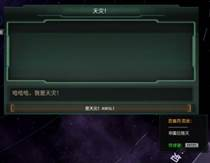
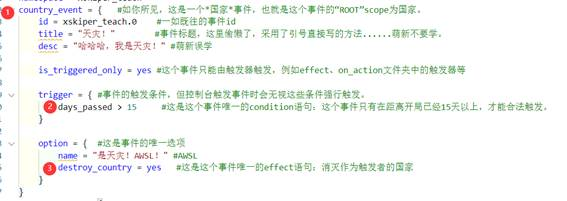

在这篇进阶教程的第一章，我们将讨论一下蠢驴 event 的基本架构，并回答一个重要的问题：

<p style="text-align: center;font-size: 1.2rem;"><b>事件究竟能做什么？</b></p>

事件，events 文件夹里那些成堆的 txt 文件，究竟能改变这个游戏到何种程度？

这个问题，我曾经以为不会被接触事件不久的萌新遇到，但我发现，如果避开这个问题......就会使很多 modder 在事件写作中产生了错误的判断，做很多无用功，或者在群里引来高血压。

所以在进一步接触事件写作之前，让我们还是摆正心态，了解一下蠢驴游戏的半壁江山（以上）——events 的基本结构，以及它能够为我们带来的东西

## 我是谁，我在哪 —— scope

**scope**，也就是范围，相信在无言的教程中大家已经有了一定的接触。但对 scope 这个概念，恐怕各位还是没有一个比较直观的印象。

**scope**的概念是蠢驴语言的一个核心，如果对其没有一个清晰的印象，modder 是无法写出较为复杂的事件的。

**那么，如何理解 scope 在蠢驴事件中的作用呢？**

大家日常的对话通常包含两个重要部分：**主语**和**谓语**。例如**萌新 A 写码**，就分为**萌新 A**这个**主语**，以及**写码**这个**谓语**。蠢驴的绝大多数效果语句也是相同的逻辑。

类比**萌新 A 写码**这句话，我们不妨看一下下面这个事件。

### 范例 1-1 天灾？AWSL

> 由隔壁舰 R mod 中某联合舰队掀起的天灾热，以相当快的速度席卷了整个 modder 圈，很多小 mod 制作者想要制作这样一个天灾以扩大订阅量。 \
> 然后我们的主人公——某个萌新 modder 也想要写一个强力无比的天灾，他想到：“只要把玩家灭国，天灾就无敌了！”最后写下了这个“天灾”。

```pdx
country_event = {           # 如你所见，这是一个*国家*事件，也就是这个事件的ROOT scope为国家
    id = xskiper_teach.0    # 槽点1：使用 0 作为 ID
    title = "天灾！"         # 槽点2：使用引号直接输入文字
    desc = "哈哈哈，我是天灾！"

    is_triggered_only = yes # 这个事件只能由触发器触发，例如 `effect` 、 `on_action` 文件夹中的触发器等

    trigger = {             # 事件的触发条件，但控制台触发事件时会无视这些条件强行触发
        days_passed > 15    # 这是这个事件唯一的 condition，即开局 15 天以上才能触发
    }

    option = {              # 这是事件的唯一选项
        name = "是天灾！AWSL!"
        destroy_country = yes   # 这是这个事件唯一的 effect 语句，消灭触发者的国家
    }
}
```

很简单的一个事件：国家 A 触发该事件，国家 A 选择选项，国家 A 暴毙。<s>wdnmd 毫无游戏体验！</s>



相信经历了无言的教程，大家都明白了 trigger、immediate、option 的作用......不过我还是在这里稍微复习一下：

-   `id` ：事件的名字，调用时就靠它，命名规则就不说了。
-   `title` & `desc` ：事件的标题&描述，通常是本地化 key，游戏内显示对应语言对应 key 的本地化文本。
-   `is_triggered_only` ：仅由触发器触发，若这个属性为 yes，除非有其他的东西（例如另一个事件，或者控制台语句）去触发它，你是不会在游戏中看见它的。
-   `trigger` ：触发条件，如果 trigger 内的条件不满足，这个事件怎么都不会触发的（控制台除外），内部填充 condition。
-   `immediate` ：即时效果，在事件触发瞬间就生效的效果，内部填充 effect。
-   `option` ：事件选项，name 属性为选项的名字（本地化 key），除了部分属性语句，内部填充的也是 effect，与 immediate 的不同在于其在选项被选择后才生效。

类比**萌新 A 写码**，我们可以说这个事件执行的主要效果就是**国家 A 暴毙**。事件代码中的 ② `destroy_country = yes` 是一个**effect**（接下来会提到），代表着**暴毙**这个动作。那么，如何确定暴毙的国家是**国家 A**，为什么这个事件里暴毙的不是**国家 B**，**国家 C**？

答案藏在 ① `country_event` 中。这代表这个事件是一个**国家事件**，这个事件的**根 scope（ROOT）**就是看到这个事件弹窗的，触发这个事件的**国家 A**。在没有经历任何**scope 跳跃**时，所有该事件的判断和效果都关于**国家 A**本身。

② `destroy_country = yes` 这一语句没有经历**scope 跳跃**，直接在**根 scope（ROOT）**执行，因此暴毙的就是**国家 A**了。



由此说来，**scope**可以比喻成一种**主语**，它代表着所有效果的目标，有了**scope**，准确地在 2200 上天的才会是你（而不是住你隔壁的蟑螂兄弟），圆神才能准确地清算你的每家每户（而不是误杀了对面的海星）。

当然这显然不是**scope**的全部，我还并没有说明如何进行**scope 跳跃**，以及很多关于**scope**的，别的操作。但作为一个概念理解，绝大部分**scope**的相关内容都是由我上边的话延伸。

## 老三样 —— effect、condition 以及 modifier

说到蠢驴的代码，最多的就是这三个东西，在自定义程度较高的代码（不止事件！），几乎都能找到这老三样。

下面我借用上文的范例，简要介绍一下老三样的前两个：**effect**与**condition**的作用。

回到这个“天灾”事件，大家可以看到我做的后两个标记：

② `days_passed > 15`

这是一个标准的**condition**语句，判断的是【距离 2200 年 1 月 1 日的日期】，只有当经过日期大于 15 天时，才会返回 `true` 。

③ `destroy_country = yes`

这是一个标准的**effect**语句，执行的效果为【摧毁当前 scope 的国家】（scope 会在之后详细介绍，在该事件中被摧毁的就是事件触发者）

很基础的两条语句，相信大家都能看英文字面意思理解它们（真不能的话你可以机翻）。在这里我可以给出一个**effect**与**condition**的定义，希望各位不要将两者混淆。

| Effect                                                                                                                                            | Condition                                                                                                                                                                                                                            |
| ------------------------------------------------------------------------------------------------------------------------------------------------- | ------------------------------------------------------------------------------------------------------------------------------------------------------------------------------------------------------------------------------------ |
| 执行的**效果**，例如【摧毁国家】、【增加资源】、【消灭人口】等，它们都是实际执行的效果，**改变了**这一局游戏的数据。                              | 判断的**条件**，例如【检查日期】、【检测人口数量】、【判断国家思潮】等，它们是判断的条件，本身**不会改变**这局游戏的内容。                                                                                                           |
| 例如**国家 A 暴毙**，如果说**国家 A**是当前的**scope**，那么**暴毙**就是一个**effect**。 `destroy_country = yes` 在这里相当于**表动作**的**谓语**。 | 例如**国家 A 有唯物主义**，你可以通过代码 `is_materialist = yes` 进行表达，这句话不会将 A 变成唯物主义，只是进行**判断**罢了。主语是**国家 A**， `is_materialist = yes` 是**有**唯物主义**的 condition**，可以说是**表状态**的**谓语**。 |

**effect**与**condition**都有各自独立的一套代码，该填**effect**的地方不要塞**condition**，反之亦然。倘若你填错了，VSC 往往会警告你（只要你正确使用了插件）：


那么如何判断这里应该填**effect**还是**condition**，或者你手上这条代码是哪种呢？

这里提供四种方法：

1. 查表：你可以在[Wiki-Effects](https://stellaris.paradoxwikis.com/Effects#Scripted_Effects)查询到绝大多数的 effect 代码，在[Wiki-Conditions](https://stellaris.paradoxwikis.com/Conditions)查询到 condition 们。只要和已有代码比对，你就能轻松发现这是哪一种。<s>这是最蠢的办法，正经人谁翻效果表啊（</s>
2. 依靠 VSC 的自动补全和报错功能：看到上边那张图了吗？插件都告诉你不能在这填了，你就别填这类代码了。一般都用这种方法，自动补全配合一定的英文基础，大部分的代码都能毫不费力的被你找到。
3. 找到两者常用的英语词汇：正如我之前的比喻，蠢驴的 effect、condition 格式都可以总结为主语和谓语，只是存在表动作和表状态的差异。 \
   那我们不妨像做英语语法题时一样，根据代码的字面含义判断其种类，就像这样：
    1. 表动作的单词：destroy、set、remove、spawn、add 等等 :arrow_right: effect
    2. 表状态的单词：has、is、can 等等 :arrow_right: condition
    3. 特殊情况：check、count 这类表示**检查**的动作词语，是 condition。
       只要看懂了这些词的大致含义，就能了解这是一个**动作**还是**状态**，进而就能分清代码属于 effect 还是 condition。
4. 找到两者的常见代码：有些代码的使用频率是远远高于其他的，当你看到一坨代码不知道咋改时，可以通过寻找它们来快速进行判断。
    1. 很常见的逻辑判断语句 \
       `AND` 、 `OR` 、 `NOT` 、 `NOR` 、 `NAND` ，这些逻辑门的含义相信大家比较熟悉（不熟悉就去百度），它们都是**condition**、**里边**包着的是，和它们**并列**的也是。
    2. 很常见的流程控制语句 \
       `if` 、 `else` 、 `else_if` 、 `while` 、 `switch` 这些流程控制语句也在蠢驴语中占有一席之地。它们都是**effect**、与它们**并列**的都是，里面包含的（除了 `limit` ）也都是。 \
       在 `if` 、 `else_if` 、 `while` 以及很多遍历型 scope 跳跃语句中，你都可以在内部看到 `limit` 语句，这里面需要填 condition（ `limit` 本身不能单独存在！），具体含义分情况，例如 `if` 中的 `limit` 代表 if 判定的条件，遍历型 scope 跳跃语句中的 `limit` 代表目标必须符合的条件（之后还会提到）。
    3. 很常见的**遍历型 scope 跳跃**语句 \
       **遍历型 scope 跳跃语句**，在之后我会进行进一步说明，但你依然可以靠它们的前缀来辨认种类。 \
       前缀为 `every` 、 `random` 的，例如 `every_owned_planet` 、 `random_owned_pop` 等代码，都是**effect**中的**遍历型 scope 跳跃语句**。 \
        前缀为 `any` 的，例如 `any_owned_planet` 、 `any_owned_pop` 等代码，都是**condition**中的**遍历型 scope 跳跃语句**。 \
        `any` 不能出现在 `effect` 中，反之亦然，不要想当然换着填，没有用的。 \

| 代码种类      | 定义         | 常见单词                                              | 遍历型 scope 跳跃       | 特殊代码               |
| ------------- | ------------ | ----------------------------------------------------- | ----------------------- | ---------------------- |
| **effect**    | 执行**效果** | 表**动作**：set、remove、add 等                       | 前缀为 `every` 或 `random` | if、while、switch 等   |
| **condition** | 判断**条件** | 表**状态**：is、can、has 等 表**检查**： count、check | 前缀为 `any`             | AND、NOT、OR、NOR、AND |
| **modifier**  | **修正**数值 | add、mult、reduce                                     | 无                      | 无                     |

你可以发现我并没有在前面提到 modifier 们，尽管它出现在标题中。因为你是无法直接在事件代码中使用 modifier 代码的。它们相当于附加在各种东西上的 buff 与 debuff，要想通过事件添加，必须自行创建一组新的静态修正（之后可能提到）。

在这一小节的最后，我再次强调一遍：effect 与 condition 都有各自独立的一套代码，该填 effect 的地方不要塞 condition，该填 condition 的地方不要塞 effect！

## 如何讲蠢驴语 —— 事件代码构思思路

在接触了**scope**、**effect**与**condition**之后，让我们再回首看一下我在第一节做出的比喻。

**scope**相当于**主语**，表明要做这个动作的人；**effect**与**condition**相当于**谓语**，表明这个人要做什么**动作**，或者要满足怎样的**条件**。将这两部分混合起来，就是一句正常的蠢驴语。

因此我们写作事件时，也要**按照蠢驴语的表述方式**进行构思。

让我们看看下面这个范例，想一想我们应该怎样构思事件。

### 范例 1-2 烂大街的自动人口迁移（其一）

> 尽管创意工坊的自动人口迁移 mod 已经相当多且非常完善了，仍然有很多萌新将其作为事件写作的第一个课题。 \
> ......但这个系统，也并没有他们想象的那么简单。

好，现在让我们想想人口迁移怎么写。

作为第一章的一个范例，我们只要求把失业的人口处理掉。（你也看到了，这是其一，迁移的问题咱们目前可解决不了）

让我们先把要求转化为蠢驴事件的表达方式，我们可以得到：

1. 人口失业；
2. 人口被鲨；

我们可以认定这两个表述的 scope 都是 pop（人口），其中 ① 包含 condition“失业”，② 包含 effect“消灭人口”。

那么我们写这个事件，就需要首先找到目标人口 scope，再对其进行处理。

让我们先完成第一步：

```pdx
country_event = {
    id = xskiper_teach.1
    hide_window = yes   # 不显示事件窗口，直接执行效果
    is_triggered_only = yes
    immediate = {
        every_owned_pop ={  # 遍历型scope跳转语句: 跳转scope到->我们拥有的全部人
            if = {  # 如果这个人口失业
                limit = {
                    is_unemployed = yes     # 判断当前scope(此时指该pop)是否失业
                }
            }
            # 处理
        }
    }
}
```

我们利用**遍历型 scope 跳转语句**，把当前**scope**转换为触发国家**拥有的全部人口**，并使用 `if` 语句进行判断：如果那个人口**失业**的话，我们就可以动手了。

当然，我们可以先简化一下代码：

```diff-pdx
country_event = {
    id = xskiper_teach.1
    hide_window = yes   # 不显示事件窗口，直接执行效果
    is_triggered_only = yes
    immediate = {
        every_owned_pop ={  # 遍历型scope跳转语句: 跳转scope到->我们拥有的全部人
-           if = {  # 如果这个人口失业
                limit = {
                    is_unemployed = yes     # 判断当前scope(此时指该pop)是否失业
                }
-           }
            # 处理
        }
    }
}
```

这里利用含**limit**的**遍历型 scope 跳转语句**来获取失业中的人口，可以让代码量短一些（这些处理之后还会详细解释，总之我们找到了帝国的所有失业人口。）

然后是进行处理，我们现在能够鲨掉这个人口：

```diff-pdx
country_event = {
    id = xskiper_teach.1
    hide_window = yes   # 不显示事件窗口，直接执行效果
    is_triggered_only = yes
    immediate = {
        every_owned_pop ={  # 遍历型scope跳转语句: 跳转scope到->我们拥有的全部人
            limit = {
                    is_unemployed = yes     # 判断当前scope(此时指该pop)是否失业
            }
+           kill_pop = yes  # 鲨掉人口的effect
            # 处理
        }
    }
}
```

`kill_pop = yes` 能够直接把当前**scope**代表的人口**消灭**，而写下这个**effect**后，我们第一次的“自动迁移事件”事件写作就结束了。

这个事件能够人道毁灭你的所有失业人口，起码能够让你的岗位界面清爽一些。（说好的迁移呢）

从这个事件的写作历程可以看出，我们的构思与码字是按照这样的逻辑进行：

1. 把你的需求，翻译成一条条**蠢驴语表述的句子**。
2. 找到每个句子**对应的主语**，尝试使用事件**寻找 scope**。
3. 找到**scope**后，对其**进行处理**。

这是目前我们由上面已经学习过的内容总结出来的事件写作经验。当你想到了一个想用事件完成的新点子时，就要按照这样的思路把你的需求梳理一下。

实际上，我们在写作事件时，可以把它拆成三种需求：

1. 何时何地，触发该事件？
2. 该事件的目标，包含哪些？
3. 我们要对这些目标进行怎样的处置？

在上面的构思逻辑，我们回答了后两个问题，至于第一个，就涉及到 on_action 等触发器的介绍，我们之后再展开讲。

## 你与事件的极限 —— mod 做不到的事

我们已经讲完了写作一个事件需要的思路，代码分类以及概念，现在就可以开工实现那些只改 common 无法实现的梦想了。

不过在此之前，我还是需要在最后谈一谈，如何做出一个合理的构思，最起码，可行的构思。

### 事件能不能实现这个？

这是你的构思能否实现的最大物理限制，如果蠢驴提供给你的代码无法实现你想要实现的功能，或者你希望调整的东西是硬代码......

尽快放弃！不要被这种陷阱困住了！（或选择前往瑞典闪击蠢驴，强迫蠢驴放出代码）

尤其是对于萌新，倘若跟一个无法实现的功能死磕，写了一堆无用无效的代码，不论对接受提问的群友，还是对萌新自己都有害无益。如果萌新自己依旧一意孤行的话，也只能是自己受到最大的伤害。

如何判断这个东西能否完成，你可以通过我对需求的分类，进行思考：

1. 何时何地，触发该事件？——>**有没有这样的触发机制？**

2. 该事件的目标，包含哪些？——>**有没有办法找到目标？**

3. 我们要对这些目标进行怎样的处置？——>**是否存在这样的 effect?**

例如你想做一个**“创造十年停战期”**的事件，我可以告诉你，**没有这样的 effect**。

没有**effect**，你就有极大概率（**在你不理解游戏机制时，就是 1000%**）写不出这个事件，其他的判断要素也是这个道理。

### 我能不能做到这个？

第二个要素，就是 modder 自身的能力。

在不熟悉机制的情况下，尽量不要尝试去处理过于复杂的事件。

这句话是对那些抄代码的同学说的，当你需求的功能很巧的被包含在某个原版，或者其他 mod 的事件时，**抄**是一个很好的主意。

但，很多时候，有些东西不是你单纯抄了改 key 就能解决的。其中涉及到的封装效果，变量处理，特殊属性很可能大大超出了你的处理能力，进而就会出现你一更改改“炸”了，或者他行你不行的情况。

抄代码的技巧我之后可能会再讲，我还是希望各位能够在抄一段代码时知道自己在抄什么的，毕竟，这大概就是这篇教程的存在价值之一。

## 小结

好啦，负能量发言结束了（）

这一篇教程中，我们了解了事件的几个基本要素，以及基本的写作思路。下面我们会像正经教科书一样进行一些总结。

1. 事件效果描述可以按照**主语+谓语**的格式，**scope**是**主语**，**effect**和**condition**是**谓语**。

2. **effect**是执行的**效果**，**condition**是判断的**条件**，两者分别有不同的代码，**不能搞混**。

3. 事件写作思路：**触发时机地点 :arrow_right: 找到目标** :arrow_right: **处理目标**。

记住这些内容，就可以开始写一些更复杂的事件了。
