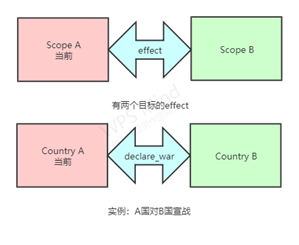
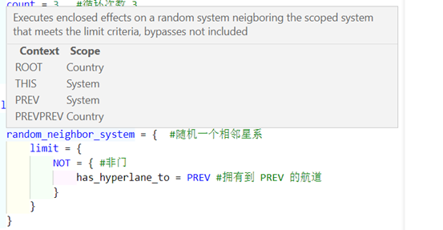
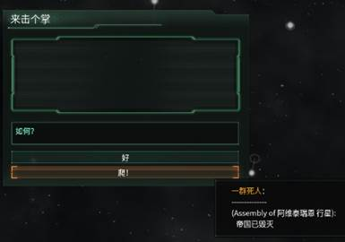
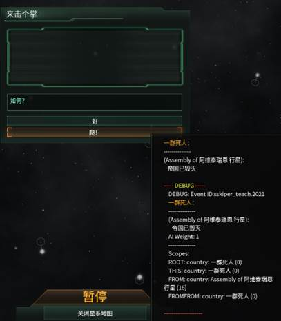

写作事件时，我们都按照**触发时机地点** :arrow_right: **找到目标** :arrow_right: **处理目标**的思路进行分析，其中**找到目标**这一部分，往往就是指找到目标对应的**scope**。这一章我们将聚焦于各种**scope**的**跳跃和调用语句**，让各位对**scope**的利用有一个比较好的理解，顺利地找到自己的理想对象（笑）。

## 对象转换 —— scope 跳跃与调用

在蠢驴语言的结构中，**scope**是表达的**主语**，相信大家已经有所体会了。大多数事件都有它默认的**基本 scope（根/ROOT scope）**，例如 `country_event` 的基本 scope 便是触发者对应的国家。

但是很多效果，都需要 scope 的转换：比如人口的迁移需要寻找到一个国家的两个星球，外交事件需要两个国家之间的互动等等。这个时候就需要我们使用**scope 跳跃语句**，对 scope 进行切换。

**scope 跳跃语句**，是蠢驴**effect**和**condition**里一类语句的统称。这类语句都用等号连接着一个**大括号**，在**大括号**内的语句，在下一次 scope 跳跃前，就是在**新的 scope**中，使用了**新的主语**。

另一方面，有些**effect**或者**condition**拥有**复数**个目标，例如判断**两国**是否在交战状态，或者改善**两国**关系都需要**两个 scope**的支持。**其中一个 scope**可以作为**主语**，但**另一个 scope**呢？只能在这种语句中充当**宾语**的定位。

这种时候我们需要在语句中调用出**另一个 scope**：使用**scope 调用语句**，这一类语句可以指代一个**scope**，它们可以是特定的**代码流程词汇**，也可以是你**事先保存的目标**。



现在让我们从最基础的**遍历型**开始，深入了解一下这些**scope 语句**。

## 遍历，还是遍历 —— 遍历型 scope 跳跃语句

我在上一章就提到了这一类遍历型 scope 跳跃语句，现在让我们就下面的实例来对它们进行探究。

### 范例 2-1 逃不过的清算

> 某个圆神信徒在完成了“清算后成功成为河长”的成就后，也兴致冲冲地加入了 mod 制作的行列。第一步就是要加大它生存的难度，搞出各式各样的圆神清算......

```pdx
country_event = {       # 一个阴间事件
    id = xskiper_teach.2
    hide_window = yes
    is_triggered_only = yes

    immediate = {
        every_owned_pop = { # 找到这个国家的所有人口
            # 以目标人口为当前Scope执行以下操作
            add_modifier = {    # 为当前Scope代表的人口添加目标修正
                modifier = pop_happiness_negative   # 修正的key
            }
        }
        every_owned_leader = {  # 找到这个国家的所有领袖
            # 以目标领袖为当前Scope执行以下操作
            set_age = 150       # 设定年龄为150
        }
        every_system_within_border = {  # 找到这个国家的所有境内星系
            # 以目标星系为当前Scope执行以下操作
            system_star = {         # 这个星系的主要恒星
                remove_planet = yes # 删除当前Scope代表的星球
            }
        }
        random_owned_megastructure = {  # 找到这个国家的随机一个巨构
            # 以目标巨构为当前Scope执行以下操作
            delete_megastructure = this # 摧毁当前Scope代表的巨构
        }
        every_country = {   # 找到所有国家
            # 以目标国家为当前Scope执行以下操作
            add_trust = {   # 增加当前Scope代表的国家对who代表的国家的信任度
                amount = -50    #增加值
                who = ROOT  # 目标位ROOT代表的国家
            }
        }
        random_owned_planet = { # 找到这个国家的随机一个拥有的星球
            # 以目标星球为当前Scope执行以下操作
            solar_system = {    # 这个星球的星系
                # 以目标星系为当前Scope执行以下操作
                starbase = {    # 这个星系的恒星基地
                    set_starbase_size = starbase_outpost    # 设定恒星基地的等级为哨站
                }
            }
        }
    }
}
```

这一片代码看起来好像比较复杂，但其实就是一串并列的效果组合在一起罢了。让我们把代码拆成一个个小的部分，看一看基础的一些**scope 跳跃语句**是如何使用的。

首先是**遍历型**。这一类 scope 跳跃语句以**any**、**every**、**random**开头，通常是对符合某一标准的群体，或是对这一群体中的随机一个进行处理。例如：

-   `every_owned_pop`
-   `every_owned_leader`
-   `random_owned_megastructure`

在**effect**区域内，这些**遍历型 scope 跳跃语句**以 `every` 或 `random` 打头，分别代表**所有**和**随机一个**。在 condition 区域内，这种语句则以 `any` 开头，代表**任何一个**的含义。

这些**遍历型 scope 跳跃语句**可以满足我们写 mod 中查询目标的绝大部分需求，下面由**范例 2-1**，举一些使用该语句进行事件制作的例子。

#### 范例 2-1-1 领袖老化

> 我们的圆神信徒首先决定从新国家的领袖下手，让被清算国家在之后的每个月，领袖的年龄保持在 150 岁......虽然没考虑寿命循环的要素，这样一个高龄也极大增加了领袖存活的难度。

首先我们需要用蠢驴语言翻译这个需求，也就是**每个月，该国家的全部领袖，设定年龄为 150**。目前不考虑触发时间的**每个月**，我们需要先找到这些领袖，在触发事件国家为 ROOT 的前提下。

```pdx
every_owned_leader = { ... }
```

这个**遍历型 scope 跳跃语句**将 scope 由 ROOT 对应的触发国家，转换到了 ROOT 所拥有的全部领袖。每个拥有的领袖都会触发大括号内的 effect，也就是：

```pdx
set_age = 150       # 设定年龄为150
```

这样你就能够令 ROOT 的所有领袖一夜白头，前提是这些领袖的种族有头发。

#### 范例 2-1-2 拆迁大队

> 接下来这位仁兄想惩罚一下那些在银河系中到处建造违章建筑的家伙，让那些被戴森球遮挡的恒星重见天日...他计划随机挑选一个触发国家的巨构，将其摧毁。

我们的新任务和**范例 2-1-1**有什么区别呢？没错，数量。

我们不再需要选择全部目标，而是要**随机挑选一个**，这种时候 every 显然就破坏力太大了，轮到我们的 random 登场：

```pdx
random_owned_megastructure = { ... }
```

然后很简单的 effect 系列：

```pdx
delete_megastructure = this     # 摧毁当前Scope代表的巨构
```

这两个最简单的 effect 带领我们对 `every` 和 `random` 有了一些了解，接下来，让我们看看 `any` 和 `limit` 的运用。

#### 范例 2-1-3 众叛亲离

> 为了更进一步地迫害玩家，这个 modder 决定从国家间的关系下手，全部的国家......不，应该把条件设的复杂一点，所有拥有拥有“灵能”特质人口的国家，对触发国家的信任减少，怎样？

好，现在难度上升了，我们剖析一下需求。

-   找到目标 A：所有国家，条件为【拥有 拥有灵能特质的人口】
-   执行 effect，effect 的目标有**两个**，一个为触发国家，一个是目标 A。

让我们一个个实现，首先是找到目标：既然目标还是所有国家，先写一个这个：

```pdx
every_country = { ... }     # 找到所有国家
```

但我们现在要找的并不是毫无限制，我们需要符合条件的国家，这时候我们就需要使用 limit 了：

```diff lang="pdx"
every_country = {   # 找到所有国家
+   limit = {
+       # 要找到的国家需要满足以下condition
+   }
}
```

通过加入 `limit` ，并在 limit 内部填入 condition，我们可以过滤我们需要选择的目标，只让**符合条件的国家**执行接下来的 effect。

接下来就是确认要符合的条件：【拥有 拥有灵能特质的人口】。我们要判断这个国家拥有人口的情况，就需要在**condition**中进行 scope 跳跃。我们可以这样：

```diff lang="pdx"
every_country = {   # 找到所有国家
    limit = {
        # 要找到的国家需要满足以下condition
+       any_owned_pop = {   # 任何一个拥有的人口
+           has_trait = trait_psionic   # 持有特质：灵能
+       }
    }
}
```

在**condition**中的**遍历型 scope 跳跃语句**，往往是以**any**开头，这类语句的含义为**任意一个**，当存在任意一个满足括号内条件的目标，就返回真。

在这里， `any_owned_pop` 就代表着**任意一个拥有的人口**，括号内的**scop**e 切换至**pop**，使得我们可以运用**pop**对应的**condition**语句进行判断。

接下来我们便可以进入 effect 的讨论了，减少信任度——按照 trust 的自动补全，我们可以轻松地找到这样的语句：

```pdx
add_trust {
    amount = x
    who = x
}
```

很快我们就发现这个语句需要**两个目标**，其中一个是**语句所在的 scope**，另一个，就是该语句属性中的 `who` 了。

那么 who 应该对应的是什么呢？这个语句的效果是：增加【当前 scope 国家】对【 `who` 对应 scope 国家】的信任度，也就是说 who 要填入触发国家对应的 scope。

那么就应该这样填写：

```diff lang="pdx"
every_country = {   # 找到所有国家
    limit = {
        # 要找到的国家需要满足以下condition
        any_owned_pop = {   # 任何一个拥有的人口
            has_trait = trait_psionic   # 持有特质：灵能
        }
+       # 以目标国家为Scope执行以下操作
+       add_trust {
+           amount = -50
+           who = ROOT
+       }
    }
}
```

......等一下。

ROOT？这是？

## PREVPREVPREV.FROMFROMFROMFROM —— 流程 scope 跳跃语句

`ROOT` 很明显不是一个遍历型 scope 跳跃语句。毕竟它不包含 every 或者 random。很多时候我们会遇到像 `add_trust` 这样，需要指定多个目标 scope 的 effect 语句，这时候我们除了需要寻找到**多个对应的 scope**，还需要把这些 scope 正确地填入到 effect 的参数中。

这时候我们有两种选择，一种是 `event_target` ，我们之后会提到；另一种便是采用**流程 scope 跳跃语句**。这类语句不像遍历型，它们往往**并不能帮助我们找到符合条件的目标**，相反，它们的作用是**调用那些我们早已找到的目标**，减少我们寻找的次数，实现只靠遍历无法实现的功能。

### 就在此处 —— THIS

当前 scope，当前 scope 我说着实在是过于绕口了，在蠢驴的语法中，现在所处的 scope，被称为 THIS。

`THIS` 指代的是**当前所在的 scope**，例如**范例 2-1-3**中 `add_trust` 所在位置的 `THIS` 就是 `every_country` 找到的国家。

像遍历型一样，你可以通过` = { ... }` 的方法把当前 scope 跳跃到 `THIS` 所对应的 scope。此举**同时对 effect 和 condition 生效**。

你可以写这样的代码：

```pdx
THIS = {

}
```

但这个代码基本上没有作用， `THIS` 指代的是当前 scope，**从当前 scope 跳到当前 scope**是没什么意义的（）

但 `THIS` 并非完全没用，有一些语句虽然从字面意义上理解只需要一个目标，**它们的目标并不是当前 scope，而需要你进行额外的指定**。例如下面这个：

```pdx
destroy_fleet = this # 这里需要指定一个目标
```

因此理解 `THIS` 的含义也是相当重要的，接下来我会逐渐用 `THIS` 取代“**当前 scope**”。

### 追本溯源 —— ROOT

在第一小节，我们提到大多数事件都有它默认的**基本 scope（根/ROOT scope）**，例如 `country_event` 的基本 scope 便是触发者对应的国家。这个基本 scope 就是我们之前写事件，没有使用 scope 跳跃语句时一直处于的 scope，能取得的，最基本的目标。

目前（截至群星 3.0.3）我们能够使用的事件有这些：

-   `event` （无 ROOT）
-   `pop_event`
-   `ship_event`
-   `fleet_event`
-   `planet_event`
-   `system_event`
-   `country_event`
-   `observer_event`
-   `starbase_event`
-   `pop_faction_event`
-   `first_contact_event`
-   `espionage_operation_event`

很多新的事件种类在 3.0.0 被添加到了群星中，蠢驴也不是只做了一些傻事（）但对于刚进入事件写作的你，我建议优先使用以下的事件种类：

-   `country_event` ROOT 为触发的国家，国家即玩家，易于理解。
-   `planet_event` ROOT 为触发的星球，对于大多数剧情向事件，这样的事件更方便你取到那个星球的相关信息，例如名字。
-   `event` 没有 ROOT，主要用于全局设置，或者无可奈何的 `on_action` 限制。
-   `ship_event` ROOT 为触发的舰船，挖坟都是这种事件，同样，剧情方便。

当然这些事件除了基本的 ROOT 不同以外都有着类似的写法，你选择事件种类可以相当随意......除了你在使用 `on_action` 的时候，会发现每种 `on_action` 都有着不同的 event 种类限制。

......看起来跑题了。

我们了解到每种事件的触发者，基本 scope，也就是 `ROOT` 之后，便可以看一下 `ROOT` 作为**effect**和**condition**在事件中的作用了。

就比方说**范例 2-1-3**，我们见到了这样的代码：

```pdx
every_country = {   # 找到所有国家
    # 以目标国家为当前Scope执行以下操作
    add_trust = {   # 增加当前Scope代表的国家对who代表的国家的信任度
        amount = -50    #增加值
        who = ROOT  # 目标位ROOT代表的国家
    }
}
```

蠢驴创造了 `ROOT` 这个东西，可不只是让我们嘴上说说的。

通过 `ROOT` ，我们可以在事件中随时调用其**基本 scope**，就算你套了 114514 层括号，我也能通过一层 `ROOT` 识破你的真面目。

`ROOT` 在事件内的任何地方都代表该事件的**基本 scope**，除了在这类多目标语句内可以作为目标指代， `ROOT` 还能够这样使用：

```pdx
ROOT = {

}
```

像之前的 `THIS` 一样，你可以通过` = { ... }` 的方法把当前 scope 跳跃到 `ROOT` 所对应的 scope。此举同时对 effect 和 condition 生效。

### 回忆上一步 —— PREV

那么除了 `ROOT` ，我们在之前的事件写作中还找到了很多别的 scope，它们不是事件的基本 scope，无法通过 `ROOT` 来查找......难道必须使用 `event_target` 了吗？大可不必（）

下一个杀器， `PREV` 在事件中有着更加灵活的运用。

#### 范例 2-1-4 航道重组

> 是时候让我们接触一些更炫酷的功能了不是吗？我们学会了遍历型，还有着 ROOT 指引方向......我们的 modder 决定让玩家帝国内的航道发生改变，就想他玩过的更多巨构 mod，其中的彭罗斯炸弹一样。 \
> 他的需求是选择触发国家境内的一个随机星系，摧毁三条航道，然后与随机相邻星系创建三条航道。

这个玩意看上去有那么一点高端了，但确实一点也不复杂。

首先我们可以尝试去找到目标：

```pdx
random_system_within_border = {     # 找到该国家随机一个境内星系
    while = {       # 循环
        count = 3   # 循环次数
        random_neighbor_system = {  # 随机一个相邻星系
        }
    }
    while = {       # 循环
        count = 3   # 循环次数
        random_neighbor_system = {  # 随机一个相邻星系
        }
    }
}
```

没错，当你在 VSC 中输入 `random` 或者 `every` 、 `any` 时，常常会出现惊喜（）很多蠢驴已经用到的**遍历型 scope 跳跃语句**极大简化了我们的写作难度。

`while` ，一个非常常见的循环语句，在 `while` 里的语句会被重复执行。限制执行的次数有两种方法，一种是 `count` 语句，如上图，我们可以通过在 while 内写 `count = x` 来让其内部 effect 仅被执行 x 次；另一种是使用 `limit` ，类似 if，while 只会在 `limit` 内部条件成立时执行内部的 effect。

在群星的 mod 制作中，while 的执行次数是有限的，也就是说会出现 limit 仍然满足，while 却不再执行的情况，需要注意。

其实遍历型中的 every 已经可以执行很多循环的效果，所以建议多多思考来优化关于循环的代码，之后会详细介绍。

接下来就要去执行效果了。不过在此之前我们还需要考虑一个问题：**相邻星系就一定存在航道吗？**

显然不是，那么我们就需要增加一个 `limit` 。

```diff lang="pdx"
random_system_within_border = {     # 找到该国家随机一个境内星系
    while = {       # 循环
        count = 3   # 循环次数
        random_neighbor_system = {  # 随机一个相邻星系
+           limit = {
+               has_hyperlane_to = PREV # 拥有到PREV的航道
+           }
        }
    }
    while = {       # 循环
        count = 3   # 循环次数
        random_neighbor_system = {  # 随机一个相邻星系
+           limit = {
+               NOT = { # 非门
+                   has_hyperlane_to = PREV # 拥有到PREV的航道
+               }
+           }
        }
    }
}
```

锵锵， `PREV` 的初 次 登 场。（是不是还有奇怪的逻辑语句混入了？）

`PREV` 和 `ROOT` 都是**流程 scope 跳跃语句**，和 `ROOT` 不同， `PREV` 代表的是，**切换至** `THIS` （当前 scope）**之前的 scope**。有点绕？我们就该范例给一个详细说明。

我们是如何找到目标星系的相邻星系的？代码经历了三个 scope。

-   首先，我们利用 `random_system_within_border` 将 scope 由 ROOT，也就是触发国家切换到了随机一个境内的星系。
-   然后我们利用 `random_neighbor_system` 将 scope 由目标星系切换至其随机一个相邻星系，也就是 THIS。

我们经历了**两次 scope 转换**，**三个不同的 scope**。PREV 就是**抵达 THIS（当前 scope）在跳跃之前所处的 scope**，也就是这里 `random_system_within_border` 所选中的星系。要判断其相邻星系是否与其有航道连接，我们只需使用 PREV 便能解决目标寻找的问题。

x 个 PREV 相连，可以指代 x 次跳跃前的 scope，例如将**范例中**的 `PREV` 换为 `PREVPREV` 就会指代**ROOT 对应的触发国家**。（当然，对于 `has_hyperlane_to` ， `PREVPREV` 是国家而不是星系，因此不是一个合法的目标。）

PREV 和 ROOT 有着类似的特性，也就是说下面这样是可行的：

```pdx
PREV = {

}
```

如果你还是觉得判断 PREV 是哪个有一点困难，你可以借助 VSC 的帮助：鼠标停留在任意语句上，你可以看到代码介绍的方框中显示着 PREV 和 THIS，ROOT 的 scope 种类，辅助你对代码的选择。



**每个种类的 scope**都有**不同的 condition 和 effect**，不匹配就会报错，还请多多注意。

让我们回到范例，完成这一段代码：

```diff lang="pdx"
random_system_within_border = {     # 找到该国家随机一个境内星系
    while = {       # 循环
        count = 3   # 循环次数
        random_neighbor_system = {  # 随机一个相邻星系
            limit = {
                has_hyperlane_to = PREV # 拥有到PREV的航道
            }
+           remove_hyperlane = {
+               from = THIS
+               to = PREV
+           }
        }
    }
    while = {       # 循环
        count = 3   # 循环次数
        random_neighbor_system = {  # 随机一个相邻星系
            limit = {
                NOT = { # 非门
                    has_hyperlane_to = PREV # 拥有到PREV的航道
                }
            }
+           add_hyperlane = {
+               from = THIS
+               to = PREV
+           }
        }
    }
}
```

`add_hyperlane` 和 `remove_hyperlane` 对应着创建/删除超时空航道，你可以发现这两条代码也与 THIS 不直接相关，需要你进行指定。

### 萌新永远的噩梦 —— FROM（其一）

终于，我们还是到了最后一个**流程 scope 跳跃语句**：** `FROM` **。

`FROM` 指的到底是什么？为什么他的代码我复制过来就失效了？这样或那样的问题中我们常常见到 FROM 的身影。FROM 就是每个写事件萌新的一大 boss，引起了无数的 bug，因此恐怕这一章我们还没办法做一个完整的介绍。

#### 范例 2-2 来击个掌

> 还是让我们把那个整天搞破坏的神经病忘掉吧，没人会喜欢那种 mod 的。 \
> 来击个掌，如何？ \
> 规则很简单，AI 国家触发事件后，随机一个玩家国家会接收到一个消息“AI 和你击掌！”你有两个选择：接受或拒绝，如果接受，什么都不会发生；倘若拒绝......那个发起击掌的 AI 国家就会灭亡。



这个功能包含三个事件，一个测试事件和 AI 方的测试事件放在下面，可以试试解读一下......很简单的。

```pdx
country_event = {
    id = xskiper_teach.202
    hide_window = yes
    is_triggered_only = yes

    immediate = {
        random_playable_country = {
            country_event = {
                id = xskiper_teach.2020
            }
        }
    }
}

country_event = {
    id = xskiper_teach.2020
    hide_window = yes
    is_triggered_only = yes

    immediate = {
        random_country = {
            limit = {
                is_ai = no
            }
            country_event = {
                id = xskiper_teach.2021
            }
        }
    }
}
```

想要测试事件，你只需要控制台触发 `xskiper_teach.202` 事件，便能随机抽取一个幸运 ai 与你击掌了。

如图，在 AI 国家触发的事件 `xskiper_teach.2020` 中，选取了一个随机非 ai 国家（就是随机玩家啦）触发了一个新的事件，这个事件是这样的：

```pdx
country_event = {
    id = xskiper_teach.2021
    title = "来击个掌"
    desc = "如何？"
    is_triggered_only = yes

    option = {
        name = "好"
    }
    option = {
        name = "爬！"
        FROM = {
            destroy_country = yes
        }
    }
}
```

这个事件只有三行是我们需要关注的：

```pdx
FROM = {
    destroy_country = yes
}
```

FROM 在这里首次出现了。

阅读我们的事件要求，我们可以发现，在玩家国家触发事件时，我们需要**逆推到上个事件**，**找到上个事件的 `ROOT` **，从而可以对正确的目标进行灭国。

`PREV` 只在一个事件内部的**scope 转换**有效，这个时候我们就需要 `FROM` 。

**在事件 A 触发事件 B 的情况下，事件 B 中的 `FROM` 代表着事件 A 的 `ROOT` 。**

同样，** `FROM` 可以连续叠加**，例如**事件 C**中的 `FROMFROM` 在**事件 A 触发事件 B，事件 B 触发事件 C 的情况下**，代表着**事件 A**的 `ROOT` 。

这是 `FROM` 出现的第一种情况，也是最简单的情况，但正如这个范例，这种**FROM 往往只在触发国家切换转变时不可替代**，也就是国家关系，外交相关的那些事件。其他时候，萌新可以采用之后会介绍的 `event_target` 来避免其使用。

或许有萌新会在听了之前的介绍依旧对 `FROM` 有点理解困难，不妨在游戏内触发事件时输入 `debugtooltip` 的控制台指令，鼠标放到事件的选项后，你可以看到事件的 `FROM` 和 `ROOT` 。可以辅助你的事件写作。



相信这样的技巧一定能够帮助到各位 modder。

FROM 的功能绝不仅限于此，它对于刚进行 event 制作的 modder 的更大意义可能在于 `on_action` 提供的可调用 scope 上，关于这一点，我在下一篇会进行更详尽的介绍。

### 流程 scope 跳跃语句 —— 小结

**流程 scope 跳跃语句**和**遍历型**有着很大的不同，它们指代的是一个**独立的目标而非一个模糊的群体**。因此它们能够成为那些，**能够在内部指定额外目标的 effect 或 condition 语句中**填写的**目标**。同时，他们**引用着我们之前所使用过的目标**，一方面便于我们**简化流程**，另一方面为我们进行一些**更复杂的**事件设计做好了铺垫。

他们可以作为**独立的 scope 跳跃语句**，也能够作为**目标填写**。其中的 `PREV` 和 `FROM` 可以**通过堆叠进行跨越多层的引用**。熟练运用 `ROOT` 和 `PREV` 是之后各位事件写作的基本要求，所以请多练多学。

## 从前有艘船，船有所有者…… —— 属性 scope 跳跃

从前有艘船，船有所有者，所有者有首都，首都有星系，星系有星基......这样的套娃可以无穷无尽，接下来我们接触的一种**scope 跳跃语句**，也是我们今天学习的最后一种 scope 跳跃语句，也就是**属性 scope 跳跃语句**。

**属性 scope 跳跃语句**，调用的是**与 THIS 相关的其他 scope**，例如语句 `owner` ，调用的就是**THIS 的所有者**，一个国家。同样的还有语句 `ruler` ，调用的就是**THIS 国家 scope**的**统治者**。这样的语句和**遍历型**不同，和**流程 scope 跳跃语句**同样只指代一个具体的目标。这些语句调用的是 `THIS` 的属性，取得一个和 `THIS` 通过某些方式对应的**scope**。

其中有一些**属性 scope 跳跃语句**是直接以**scope 类型**来命名，不像 `owner` 之类浅显易懂，比如这些：

```pdx
pop = { ... }
planet = { ... }
fleet = { ... }
```

这些语句的命名就是 Scope 种类。

在使用这种语句时一定要注意，只有当**THIS 对应的目标只有一个时**，这样的语句**才会正常运作**。比方说，对于一个国家，它有无数个 pop，**THIS 为国家时，使用 pop 来跳跃 scope 显然是错误的**；而对于一个 pop，他只在一个星球上，**THIS 种类为 pop 时使用 planet 来跳跃 scope 就是正确的**。

同时这些**scope**语句也能**作为目标填写到那些需要填写目标的 effect 或 condition 语句中**。这一点和**流程 scope 跳跃语句**是类似的。

## 小结

我们在本章学习了三种不同的**常用 scope 跳跃语句**：**遍历型 scope 跳跃语句**、**流程 scope 跳跃语句**、**属性 scope 跳跃语句**。运用这些语句我们可以轻松地找到各种各样的目标。下面的练习题也将会侧重于寻找目标的方法，希望各位对 scope 转换能够在参考习题后有了更深的理解。

来列一个表格吧。

| **遍历型 scope 跳跃语句**                    | **流程 scope 跳跃语句**                                | **属性 scope 跳跃语句**                                |
| -------------------------------------------- | ------------------------------------------------------ | ------------------------------------------------------ |
| 搜索模糊的群体，批量处理大量符合条件的目标。 | 指代独立的个体，寻找在之前的事件代码中已经找到的目标。 | 指代独立的个体，来源为当前 scope，也就是 THIS 的属性。 |

接下来让我们回到上一章，也就是[范例 1-2](event_modding_advanced/border_of_event.md#范例-1-2-烂大街的自动人口迁移其一)，现在我们已经有了自动迁移人口的能力了。让我们再解析一下目前需要的目标。

### 范例 2-3 烂大街的自动人口迁移（其二）

-   找到一个 ROOT（触发国家）拥有的，有空闲岗位的星球。
-   找到一个 ROOT 拥有的，没有工作的 pop。
-   将目标 pop 迁移到目标星球上。

在熟悉掌握了流程 scope 跳跃语句后，我们可以这样填写：

```pdx
country_event = {
    id = xskiper_teach.203
    hide_window = yes
    is_triggered_only = yes

    immediate = {
        every_owned_pop = {         # THIS拥有的全部人口
            limit = {
                is_unemployed = yes # 判断THIS（该pop）是否失业
            }
            ROOT = {        # 回到ROOT，即触发国家
                random_owned_planet = { # THIS拥有的随机一个星球
                    limit = {
                        free_jobs > 0   # 有空闲岗位
                    }
                    resettle_pop = {
                        pop = PREVPREV  # 回到前2个Scope，也就是 `every_owned_pop` 找到的人口
                        planet = THIS   # 有空闲岗位的目标星球，也就是THIS
                    }
                }
            }
        }
    }
}
```

当然这还不是人口自动迁移的全部，但作为一个基础，它已经有了足够的功能......我们在（其三）见。
