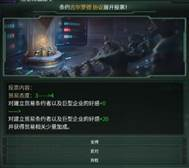
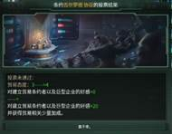
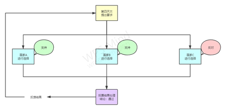

这篇教程面向那些较为熟悉群星 mod 制作方法和工具（例如对 common 的大部分文件都有了一定了解），但苦于不熟悉蠢驴事件的结构如何满足自己构想的 modder 们<s>，所以完全不知道啥是事件啥是 modifier 啥是 AND OR NOT 的可以出门左转了</s>。

当然如果你满足于修改武器、科技数值，图标和本地化，没有事件写作需求的话，也可以跳过这个教程了，毕竟前面将会是一堆事件代码示例，乱七八糟的效果解析，可能会伤害到不少萌新......但对于有能力在群星 mod 制作中更进一步的同志，我还是十分希望这个教程能提供一些帮助的。

言归正传，让我们看看绪论要讨论的主要问题：

<b>这个教程究竟是在搞什么？</b>

作为进阶教程，我在这里的主要目的是介绍一些常用的事件写法以及思路，给 modder 们打通思路，想明白如何利用蠢驴提供的有限代码达到自己的目的，换句话说，戴着镣铐起舞（笑）。

如何理解这个目的呢？我在这里可以举几个简单的事件例子给你们体会下（）

范例 简单且无聊的投票事件

举几个小例子，如果你想搞点小弟跟你一起投票开会的排面活，你就需要一系列在各个国家传递的事件，就像这样：

很简单的流程图，通过玩家国家启动开关，触发 A、B、C 三个国家的事件，A、B、C 三个国家选择后，再将投票数据通过另一个事件反馈到玩家国家即可。

我们决定写三个事件：投票触发（以下简称事件 α）、投票选择（以下简称事件 β）、投票结果总结（以下简称事件 γ）

但是这里出现了几个问题：

-   如何在 A、B、C 三个国家的事件 β 中找到事件 α 的触发者，以得到文本引用国家名字，以及反馈到正确的目标，使玩家国家准时触发事件 γ 的效果？
-   如何计算投票支持票和反对票数量，以得到法案是否通过的结果？
-   如何在不同的投票结果下同一事件（即事件 γ）显示不同文本？
-   如果有投票者是玩家，选择拖延时间，不进行投票（即“断无此疏”），如何强迫其投票？

这样或那样的问题，就会开始出现，无疑对于萌新是一个巨大打击（尽管我敢说没有萌新会尝试写这种东西，写了也不会考虑这些情况）。这个教程的主要目的，就是介绍这些问题的解决思路，帮助进阶 modder 更好的进行事件写作。

如上面这些问题所示，就技术层面，这篇教程的主要内容是关于事件的各种小技巧和操作实例。例如 scope 语句的使用详解，UI 的制作，变量和 flag 的使用，各种封装效果的使用方法等。
而事件制作更重要的，则是思路。在各个技巧与实例之外，我也会谈谈设计事件的思路方向，如何从自己的能力出发，想出可行的 mod 文案，如何把脑内点子转换为可行的“蠢驴思路”，以及如何更快更好的提升 modding 技术。
以上一堆废话说完了，我们就可以开始教程的第一篇了，正式深入 events 这一个 stellaris mod 核心，芜湖~
