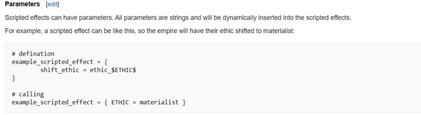

蠢驴虽然对群星里很多效果语句作了极大限制，并且缺乏游戏内数据的调用函数，但他却打开了一扇窗，能让我们通过一些旁门左道完成一些看似单纯使用 effects 语句无法达成的效果。如果你习惯于翻查英语 wiki 来增进你对群星 modding 的了解，你也许会发现 wiki 里有这一个特别的页面。

<p style="text-align: center; font-size: 1.2rem"><a href="https://stellaris.paradoxwikis.com/Dynamic_modding">Dynamic Modding</a></p>



## 参数传递

如上图所示，scripted effect 是可以传递参数的。这种传递参数的运作方法有点像 C 的宏，也就是单纯的**_字串替换_**。在上述例子中，你需要首先在 `common/scripted_effects` 定义一个 scripted effect，并在想要被替换的内容前后加上一个` $` 符号，然后在` $` 符号内定义这个被替换内容的参数名，之后回到 event 文件里调用该 scripted effect。但与正常使用 scripted effect 的时候直接在脚本效果名后加上` = yes` 不同，你需要给与参数一个值，具体写法请看` # calling` 下方的语句。

在执行的时候，$符号以及参数名会一起被替换为该参数的输入值然后再执行。

这样就和一般程序的函数(function)有异曲同工之妙了，定义一个参数，然后调用时给与这个参数的值，最后在函数内参数的值被替换为执行函数时所定义的值

再清晰一点，具体执行效果是这样的：

首先 scripted effect 的运作原理是，将它定义里面一大串的程序直接复制粘贴到程序调用的位置

定义以下一段 scripted effect：

```pdx
example_scripted_effect = {
    shift_ethic = ethic_materialist
}
```

在 event 调用这段 scripted effect 时需要这样写：

```pdx
example_scripted_effect = yes
```

这样这段东西就会替换成：

```pdx
shift_ethic = ethic_materialist
```

但是如果上述的 scripted effect 写成这样：

```pdx
example_scripted_effect = {
        shift_ethic = ethic_$ETHIC$
}
```

那么你就需要为 `ETHIC` 这个参数提供一个值（` $` 符号代表定义 `ETHIC` 是一个参数）。

于是你需要将后边原本` = yes` 的部分的写法换成这样写：

```pdx
example_scripted_effect = { ETHIC = materialist }
```

其中我们定义了 `ETHIC` 这个参数的值是 `materialist` ，因此数据在传递后 `ETHIC` 就会被替换成其定义的值，也就是 `materialist` ，整个脚本效果复制到 event 后执行的效果是：

```pdx
shift_ethic = ethic_materialist
```

<s>和第一种写法的效果其实一模一样。</s>

## 参数判断(Parameter Conditions)

让我们顺着 wiki 继续看下去，我们会发现他多了使用一个中括号的东西：

```pdx
[[homeworld] <<<STUFF HERE>>>]
```

wiki 里的英文的解释意思就是，如果` $homeworld$` 参数被输入了一个值，那么中括号里的东西就会被执行，反之就不会。值得注意的是，需要在语句最前面先定义需要判定的参数是哪个，然后用中括号把这个参数括好，最后再用一个中括号把整段需要判断是否执行的代码括好。

依旧是一个例子（请注意在 country 作用域之下调用这段代码）

```pdx
create_fleet_test = {
    create_fleet = {
        [[NAME] name = $NAME$]
        effect = {
            set_owner = PREV
            create_ship = {
                name = random
                design = "NAME_Nomad_Cruiser"
                upgradable = no
            }
        }
    }
}
```

如果你按正常方法调用这个脚本效果，（写成 `create_fleet_test = yes` ）你会发现多了一个以系统随机命名的名字的舰队，舰队里面就只有一艘巡洋舰，并没有什么 bug。

而如果按以下方法调用的话：

```pdx
create_fleet_test = { NAME = "滑稽" }
```

那么舰队的名字应该会变成了“滑稽”。

由于 `create_fleet` 方法里 name 这项参数是可以被忽略的，而 scripted effect 里中括号的作用是判断某个参数是否传入。如果参数输入了，那么中括号内的那行代码会传入输入的参数值并执行；反之，如果调用函数时参数没有输入，那么整行代码都不会被执行。

请注意，这个判断的参数不需要实际存在于函数中，或使用` $` 符号宣告这个参数，也就是说你可以随便写一个用作判断的参数然后随便输入一个值去让它判断是否执行函数中某一些地方的效果。

这种中括号的使用方法很适用于一些可忽略某些参数的函数里，这样省去了逐个逐个填写参数的麻烦。与这种参数判断相对应的还有参数预设值

## 参数预设值(Fallback Value)

如果你们已经理解上面两节关于 scripted effect 函数的基本用法的话，想要设计很多段需要输入不同参数但内容几乎一样的代码时，那么你们大可以写一个有参数的 scripted effect，然后调用时参数直接写上所需的值，一看就是很高大上的方法。但蠢驴留下的功能远不止这样。在 wiki 中关于中括号用法下方还有一小段：

```pdx
has_global_flag = crisis_stage_$STAGE|1$
```

这段代码除了我们介绍过的$符号和参数外，还有一个直线` |` 符号和后面跟着的数字。

这个` |` 符号定义了其后面的值是符号前面的参数的预设值。也就是说当 `STAGE` 这个参数**没有任何输入值**时，它会自动变成 1，甚至都不需要你写。

同样先来一个小例子：

```pdx
set_variable_test = {
    set_variable = { which = A value = $VALUE|2$ }
}
```

如果我直接调用这个脚本效果（也就是 `set_variable_test = yes` ）

那么这个变量就会是 `A: 2`

但如果我给参数一个值，写成 `set_variable_test = { VALUE = 10 }`

那么这个变量就会是 `A：10`

这些功能能够大大简化代码内容，甚至达到了一些天机工程的效果。<s>学到这里的话你就可以写在群里对大部分人装逼了（）</s>

当然还远远不止于此，蠢驴还给了你最后一项法宝：

## 参数计算(Inline Math)

有时候或许我们需要对数值进行一些计算，例如每年呈一个指定的数学公式增长一些资源，但以蠢驴的 effect 来说，最多只能做到以月收入为基础增加资源，除此之外就只能自己算然后穷举数值，这样确实非常非常的不方便。或许蠢驴自己写代码的时候也感受到了这点，于是就开发了这段功能。

```pdx
inline_math_example = {
     add_monthly_resource_mult = {
         resource = unity
         value = $COUNT|1$
         min = @\[ $COUNT|1$ * 10 ]
         max = 99999999
     }
 }
```

在上面这个例子里，我们再度看到了一个中括号，但它的前面还有两个符号` @\`

:::note[提示]

编者注：在蠢驴的源码里边还有出现过` @[]` 格式，同这个一样的效果，但是不要这么写，这么写就真的是天机工程了。

:::

:::note[提示]

请注意` \` 号的方向，不要打错成` /` 号了，vscode 里的 cwtool 里是没有任何关于这个章节的内容的判断的，也就是这个章节的东西用了就可能会出红色底线！不会有正确提示的！

:::

这个` @\` 加中括号的组合是用来计算中括号里面的数学运算的。（目前本人测试只支持**四则运算**，开方和三角函数之类的想都不要想了）

假如我们调用 `inline_math_example = { COUNT = 5 }` ，那么这段代码就会给你 5 个月的凝聚力收入，最低为$5 \cross 10 = 50$点。

假如我们再魔改一下这段函数：

```pdx
inline_math_example = {
        add_monthly_resource_mult = {
                resource = $RESOURCE$
                value = $COUNT|1$
                min = @\[ $COUNT|1$ * 10 ]
                max = 99999999
        }
 }
```

其实就和原版的 `add_monthly_resource_mult` 方法几乎没什么分别了，只是少输入了两个参数值而已。所以对于这些并不复杂的函数的魔改就请自己衡量一下把，毕竟蠢驴自己定义的 effect 才是效率最高的方法，再此之上的旁门左道都必须得先用蠢驴自己的方法跑一边，然后在跑一遍你的函数，这样效率就会成指数增长了，对于效率厨来说是非常不友好的事情。

而且这种参数计算还有一个坏处，**它在每个脚本效果里只能被使用一次，_只有代码最为靠上的一行参数计算生效_**。<s>（不愧是你，蠢驴；拳头，硬了）</s>

```pdx
inline_math_example = {
     add_monthly_resource_mult = {
         resource = unity
         value = @\[ $COUNT|1 + 3$ ]
         min = @\[ $COUNT|1$ * 10 ]
         max = 99999999
     }
 }
```

比如这段写了两个参数计算的脚本效果，只有 `value` 那一行的会生效， `min` 那一行的它（大概）会保持原参数不动，而解决方法是——套娃！

## 递归(Recursion)

之所以特意开一个小节来解释所谓的套娃是怎么回事，是因为在下一个大章节中会重复用到这个概念。为了让大家有一个好一点概念，我会尽量地解释得更详细，让你们能跟上我的思维。如果你们已经在计算机课或者别的地方学过并熟悉这种概念，那么请跳过这一章。

递归是指函数自己引用自己的情况。例如以下一段数学函数$f(x) = 3x + 2$ 。如果我让$x = 2f(x)$，那么先将$x = 2f(x)$代入一次，就会变成$x = 3(2(f(x)))+2$，再次代入$f(x) = 3x + 2$就会变成 $x = 3(2( 3x +2) ) +2$。这就是函数自己引用自己，也就是在套娃。而这样无条件地递归就会导致递归一直下去导致无法停止的情况，也就是俗称的死循环。所以一般来说我们都要给函数设立一个停止条件，防止这种无限套娃的情况。

值得一提的是，一般大多数程序都会设置有递归次数上限(maximum recursion depth)，该数值限制了你能让函数自己引用自己多少次便自动停止的情况，而群星里该上限为$5$，这个数值同样也适用于本地化使用` $` 符号引用其他词条的情况（会导致本地化变成"MAX RECURTION DEPTH"的罪魁祸首）所以请各位 modder 在使用本章节谈及的内容时特别注意这一点。

在上一章节我们已经谈及到使用蠢驴的参数计算` @\[]` 的功能的时候只能计算一次的情况。要解决这个问题，本章节所提及的递归就能有效地解决这个困境。先看以下一段函数。

```pdx
# 输入一个值，并输出这个数阶乘的值至return_value变量
factorial_variable = {
    # 因为蠢驴没有方法直接判定函数里的输入值，所以我们需要一个变量暂时记录这个数值
    set_variable = { which = depth value = $VALUE$ }
    if = {
        # 在剩余阶乘次数大于1（1没效果）的时候继续递归，否则不执行任何效果导致函数停止
        limit = { check_variable = { which = depth value > 1 }}
        if = {
            # 在第一次执行函数时先将数值初始化，将return_value设定为输入值
            limit = { check_variable = { which = return_value value <= 0 }}
            set_variable = { which = return_value value = $VALUE$ }
        }
        # 将记录的输入数值-1，然后输出数值乘以这个数值
        subtract_variable = { which = depth value = 1 }
        multiply_variable = { which = return_value value = depth }
        # 最后再次递归函数
        factorial_variable = { VALUE = @\[$VALUE$ - 1] }
    }
}
```

让我们先手动跑一遍这个程序。假设我这样引用这段效果 `factorial_variable = { VALUE = 3 }`

在一开始 depth 变量就会变成 3。执行第 5 行到第一个 if 时条件通过($3 > 1$)，到第 8 行第二个 if 时也通过了（变量初始值为 0，当然如果你已经引用过一次这段效果并且没有将变量归 0 当我没说），所以 `return_value` 就会变成 3。接着到第 14 行 `subtract_variable` ，这个效果是将变量减去指定数值，所以 depth 减 1 了变成了 2，然后第 15 行 `multiply_variable` 是乘以数值，所以就是将 `return_value` 乘以 `depth` ，也就是$3 \cross 2 = 6$。最后第 17 行函数再次被引用，但是 `value` 那里有一个参数计算，参数 `VALUE` 被计算成自己减去 1，所以再次执行函数时， `VALUE` 就会成为 2 而不是 3。如此循环下去，到 1 的时候就停止了，因为任何数乘以 1 都是自己，没有必要计算。结果 `return_value` 就会变成 6。

为了让大家直观一点看，我拉了一个表：

|                    |       `depth`        | `return_value` | `VALUE` |
| ------------------ | :------------------: | :------------: | :-----: |
| 第一次引用 – 行 2  |          3           |       0        |    3    |
| 第一次引用 – 行 8  |          3           |       3        |    3    |
| 第一次引用 – 行 10 |          2           |       3        |    3    |
| 第一次引用 – 行 11 |          2           |       6        |    3    |
| 第一次引用 – 行 12 |          2           |       6        |    2    |
| 第二次引用 – 行 2  | 2（重新设定了一次）  |       6        |    2    |
| 第二次引用 – 行 10 |          1           |       6        |    2    |
| 第二次引用 – 行 11 |          1           |       6        |    2    |
| 第二次引用 – 行 12 |          1           |       6        |    1    |
| 第三次引用 – 行 2  | 1（重新设定了一次）  |       6        |    1    |
| 第三次引用 – 行 5  | 条件不通过，函数结束 |       /        |    /    |

经过这一连串的计算之后，我们就得出了准确的结果，达成成就：**在群星做数学运算（1/1）**

当然这只是一个简单的例子，并没有任何实用价值，因为实际上当输入值大于5的时候这个函数就不管用了，理由是上述提及到的**递归上限**。但希望你能够理解递归和函数间互相引用的概念。
