# MOD 基础知识与准备

## MOD 的工作原理

众所周知，MOD 是游戏的一个非官方扩展，而 P 社的 MOD 的工作原理基于相同文件的映射和覆盖，比如 MOD 里面存在一个和原版 stellaris**相同文件夹的相同名称的文件**，那么 MOD 将会替代它，如果不是相同文件则会加入到游戏之中成为额外的部分。

如图 1（stellaris 原版文件夹）图 2（某个 mod 的文件夹），当 mod 被运行的时候，图 6 的内容会优先覆盖图 1 文件夹里面的内容，当然也添加了图 2 没有重复名称的文件。通过这样的一种机制，便实现了对于原版的修改或者添加新的内容。如果想要探讨不同 MOD 之间的覆盖规则详见第九章。

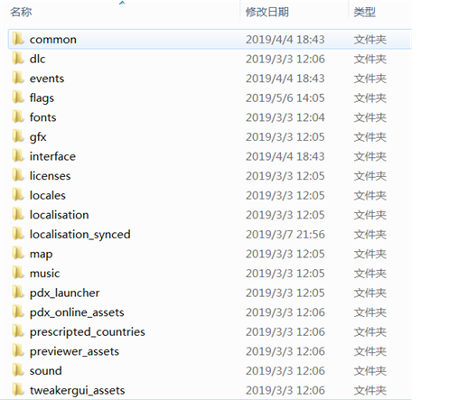

<p align="center">
    <small>图1</small>
</p>

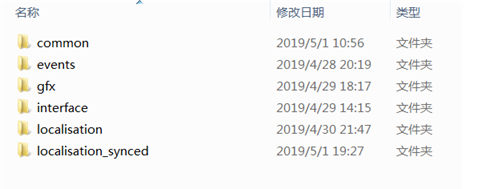

<p align="center">
    <small>图2</small>
</p>

## Stellaris 的具体文件组成

### Common 中的主要文件

:::danger[重要提醒]

尽量不要从议程开始学习，由于版本更替，议程已并不适合作为初学 mod 的基础条目，建议从法令（edicts）开始学习较为简单！之后可以自行接触其他条目，你觉得简单，亦或是感兴趣的都可以，不必拘泥于教程所展示的顺序。

:::

教程当中暂缺的条目大部分可以在蠢驴的原文件下方找到说明文件，能够看懂的可以参照说明进行编写。

> 注：由于教程编写时间以及蠢驴更新条目的原因，目录所示条目与下表介绍顺序并不相符，因此从下表或目录索引到你需要的条目解释皆可。

| 条目名称                                                                                          | 条目内容                                                                                                                                                               |
| ------------------------------------------------------------------------------------------------- | ---------------------------------------------------------------------------------------------------------------------------------------------------------------------- |
| [agendas](/guides/common_modding/agendas)                                                         | 议程，所有的可以使用的议程的集合                                                                                                                                       |
| agreement_presets                                                                                 | 外交附庸条例条目之一                                                                                                                                                   |
| agreement_resources                                                                               | 外交附庸条例条目之一                                                                                                                                                   |
| agreement_term_values                                                                             | 外交附庸条例条目之一                                                                                                                                                   |
| agreement_term_values                                                                             | 外交附庸条例条目之一                                                                                                                                                   |
| ai_budget                                                                                         | 定义 AI 的行为相关，主要是用于 AI 的计划经济                                                                                                                           |
| ai_espionage                                                                                      | AI 的间谍行动相关                                                                                                                                                      |
| ai_force_species                                                                                  | 定义 AI 优先选择哪类物种增长的逻辑                                                                                                                                     |
| [artifact_actions](/guides/common_modding/archaeology#小型文物活动artifact_actions)               | 小型文物的使用选项                                                                                                                                                     |
| [archaeological_site_types](/guides/common_modding/archaeology#考古遗址archaeological_site_types) | 各种坟头                                                                                                                                                               |
| ambient_objects                                                                                   | 用于定义出现在异常之中的模型                                                                                                                                           |
| anomalies                                                                                         | 异常，所有的可使用异常                                                                                                                                                 |
| [armies](/guides/common_modding/armies)                                                           | 陆军，不论是事件生成的还是可以建造的（灵能部队/基因部队等）                                                                                                            |
| [ascension_perks](/guides/common_modding/ascension_perks)                                         | 飞升，一切飞升的集合（三大飞升等）                                                                                                                                     |
| asteroid_belts                                                                                    | 小行星带，用于定义小行星带的模型                                                                                                                                       |
| attitudes                                                                                         | 用于定义 AI 的态度类型（谨慎/中立/敌对等）                                                                                                                             |
| bombardment_stances                                                                               | 用于定义轨道轰炸的类型（末日轰炸/有限轰炸等）                                                                                                                          |
| [buildings](/guides/common_modding/buildings)                                                     | 建筑，各类建筑的集合（合金厂/剧院等）                                                                                                                                  |
| [button_effects](visual/custom_gui#gui-模板)                                                      | 用于自定义 UI 界面的按钮效果                                                                                                                                           |
| bypass                                                                                            | 用于定义星门/虫洞类设施相关（就是可以从一个星系传送到另一个星系的玩意）                                                                                                |
| [casus_belli](/guides/common_modding/casus_belli)                                                 | 战争借口，用于定义战争的借口（全面战争/侵略等）                                                                                                                        |
| colony_automation                                                                                 | 定义殖民地自动化建造模板内容                                                                                                                                           |
| colony_automation_exceptions                                                                      | 定义一般殖民地以外的自动化建造模板（犯罪星球之类的）                                                                                                                   |
| colony_automation_categores                                                                       | 定义殖民地自动化建造模板类别                                                                                                                                           |
| colony_types                                                                                      | 殖民地类别，定义殖民地的类别（精炼星球/科研星球等）                                                                                                                    |
| colors                                                                                            | 颜色，用于国家颜色选择的定义                                                                                                                                           |
| [component_sets](/guides/common_modding/ship#组件集合component_sets)                              | 舰船部件的定义文件                                                                                                                                                     |
| component_tags                                                                                    | 用于将修正器和舰船的组件关联在一起（能量/动能等）                                                                                                                      |
| [component_templates](/guides/common_modding/ship#舰船部件component_templates)                    | 舰船部件，每种武器的属性设置（伤害/槽位/冷却等）                                                                                                                       |
| country_container                                                                                 | 用于定义国家组成部分所属于的经济分类，例如收支类型的自定义修正本地化，需要同时修改 economic_categories 才有效                                                          |
| country_customization                                                                             | 定义给予各种帝国定制化的操作，给予自动生成帝国的旗帜与物种肖像定制（说白了就是让某一类国家旗帜趋向于同质化，不同国家体现差异化，蠢驴只给了机械，蜂巢和普通帝国的定制） |
| country_limits                                                                                    | 蠢驴抽风的表现条目之一，定义各类船只的容量以及使用限制                                                                                                                 |
| country_types                                                                                     | 定义国家类型，设置他们的规则（堕落/普通/天灾/各种野怪/中立势力等）                                                                                                     |
| crisis_levels                                                                                     | 定义化身天灾的天灾等级（可修改内容极少）                                                                                                                               |
| decisions                                                                                         | 星球法令，生效在星球上的各种法令（促进人口增长/宣布禁止人口增长等）                                                                                                    |
| defines                                                                                           | 设置游戏的基本参数                                                                                                                                                     |
| deposits                                                                                          | 地块，设置星球上的行星地块（高山/富矿/海岛/城市废墟/工业废土等），包括非殖民星球的资源产出。                                                                           |
| deposit_categories                                                                                | 定义地块的经济类别以及一些其他属性（稀有，障碍等性质）                                                                                                                 |
| diplo_phrases                                                                                     | 外交语言触发，设置国家间使用的外交用语的逻辑与触发（敌对语句触发/交战语句触发等）                                                                                      |
| diplomacy_economy                                                                                 | 定义外交行动的经济条件类型以及所需条件                                                                                                                                 |
| diplomatic_actions                                                                                | 定义外交行动，目前只能修改现有的，无法新增                                                                                                                             |
| districts                                                                                         | 区划，设置各种类型的行星区划（城市/发电/矿产/农业等）                                                                                                                  |
| dynamic_text                                                                                      | 目前作用未知                                                                                                                                                           |
| edicts                                                                                            | 法令，设置各国所可用法令（封圣/科研补贴/圣地/外交补贴等）                                                                                                              |
| [ethics](/guides/common_modding/edicts)                                                           | 思潮，设置各种思潮，以及对应的国家修正（军国/极端和平等），若需要设置开局可选，必须修改 UI 文件                                                                        |
| ethic_categories                                                                                  | 定义思潮类别                                                                                                                                                           |
| espionage_assets                                                                                  | 定义间谍行动的线人                                                                                                                                                     |
| espionage_operation_categories                                                                    | 定义间谍行动的类别                                                                                                                                                     |
| espionage_operation_types                                                                         | 定义间谍行动的具体内容                                                                                                                                                 |
| event_chains                                                                                      | 事件链，设置可用的事件链                                                                                                                                               |
| economic_categories                                                                               | 经济分类文件。用于定义整个游戏内所有的经济收益（区分是是什么部分，整个部分是否有加成，有什么加成等）\*注意，有些内容和硬代码相关，不要更改！                           |
| economic_plans                                                                                    | AI 的经济计划，设定 AI 的经济收入目标以驱动 AI 运营                                                                                                                    |
| fallen_empires                                                                                    | 堕落帝国，设置可被生成的堕落帝国                                                                                                                                       |
| federation_law_categories                                                                         | 联邦法律类型                                                                                                                                                           |
| federation_laws                                                                                   | 联邦法律，具体的内容                                                                                                                                                   |
| federation_perks                                                                                  | 联邦加成，用于提升联邦等级后的加成                                                                                                                                     |
| federation_types                                                                                  | 联邦类型，如霸权联邦，贸易联盟等                                                                                                                                       |
| first_contact                                                                                     | 首次接触，用于首次接触的特殊项目（其实就是坟头），由于涉及到了一定的硬代码，不建议修改。                                                                               |
| galactic_community_actions                                                                        | 定义星海共同体主席国/皇帝的行动花销（目前只能修改经济类别与操作成本，用处不大）                                                                                        |
| galactic_focuses                                                                                  | 定义星海共同体的银河焦点内容                                                                                                                                           |
| game_rules                                                                                        | 用于各种游戏操作的逻辑，即是否可以奴役 pop。这里的逻辑不会覆盖硬编码规则                                                                                               |
| global_ship_designs                                                                               | 设置全局具体舰船配置，供以各类刷船使用                                                                                                                                 |
| [governments](/guides/common_modding/goverments)                                                  | 设置公民性（国策）、政体、政府形式（矿业工会/寡头制/同甘共苦等）以及起源                                                                                               |
| graphical_culture                                                                                 | 定义图形文化以供其他地方使用（开局让你选母星背景的地方）                                                                                                               |
| leader_classes                                                                                    | 领袖等级，定义领袖等级的相关设定                                                                                                                                       |
| [inline_scripts](/guides/dynamic_modding/inline_scripts)                                          | 内联脚本，将会单独开一个章节介绍                                                                                                                                       |
| map_modes                                                                                         | 地图模式，可以允许一定条件下用不同颜色显示银河系，不需要改动 UI                                                                                                        |
| megastructures                                                                                    | 巨构建筑相关                                                                                                                                                           |
| message_types                                                                                     | 用于 UI 上方提示信息内容，原版就是被宣战/科技研发完成/探索完成等                                                                                                       |
| name_lists                                                                                        | 名称列表，定义不同种族的不同随机名称                                                                                                                                   |
| observation_station_missions                                                                      | 土著观察任务，定义观察任务的类型（被动观察/主动观察等）                                                                                                                |
| on_actions                                                                                        | 触发器，设置各类需要特定触发的事件列表                                                                                                                                 |
| opinion_modifiers                                                                                 | 关系修正，一个国家对于另一个国家的关系的修正（有利的贸易协定+100 等）                                                                                                  |
| personalities                                                                                     | AI 性格，由于 AI 的角色扮演设置（民主斗士/奴隶暴君等）                                                                                                                 |
| [planet_classes](/guides/common_modding/planet_classes)                                           | 星球类别，所有星球，包括恒星的设置（G 级恒星/大陆星球等）                                                                                                              |
| planet_modifiers                                                                                  | 星球修正器，用于设置星系生成时自然添加的星球 buff 的概率设定                                                                                                           |
| [policies](/guides/common_modding/policies)                                                       | 国家政策，所有的国家政策的集合（奴隶制/战争哲学/轰炸政策/经济政策等）                                                                                                  |
| pop_categories                                                                                    | 人口阶级（统治者/专家/劳工/复杂子人口等）                                                                                                                              |
| pop_faction_types                                                                                 | 党派，设置不同方面的党派生成和需求（军国主义派系/孤立主义派系等）                                                                                                      |
| [pop_jobs](/guides/common_modding/pop_jobs)                                                       | 人口职业，所有工作的集合（矿工/农夫/科研人员/工匠等）                                                                                                                  |
| [relics](/guides/common_modding/archaeology#遗珍relics)                                           | 遗珍，比如银河之星                                                                                                                                                     |
| random_names                                                                                      | 随机名称，定义随机生成的名称（帝国/党派等）                                                                                                                            |
| [scripted_effects](/guides/dynamic_modding/scripted_effect)                                       | 封装触发的效果，一般用于事件效果（帝国生成/小灰转化等）                                                                                                                |
| [scripted_loc](/guides/dynamic_modding/scripted_localization)                                     | 封装触发的文本，用于经常被引用的文本生成                                                                                                                               |
| [scripted_triggers](/guides/dynamic_modding/scripted_triggers)                                    | 封装条件判断，用于经常被引用的事件判断                                                                                                                                 |
| [scripted_variables](/guides/event_modding/further#脚本变量scripted-variables)                    | 常量，用于经常被引用的数值（科技数值等）                                                                                                                               |
| [script_values](/guides/dynamic_modding/script_values)                                            | 脚本值，用于复杂变量操作                                                                                                                                               |
| [section_templates](/guides/common_modding/ship#舰船区段section_templates)                        | 船只的分段，例如战列舰有三个分段，这里就是定义某一个分段的文件                                                                                                         |
| ship_behaviors                                                                                    | 船只行为，用于设置舰船以及舰载机的船只行为                                                                                                                             |
| [ship_sizes](/guides/common_modding/ship#舰船类型ship_sizes)                                      | 舰船类型，例如普通帝国的战列舰，不管用什么分段，基础情况下这个战列舰就算是一个“类型”                                                                                   |
| solar_system_initializers                                                                         | 恒星系生成器，用于一切恒星系的生成                                                                                                                                     |
| special_projects                                                                                  | 特殊项目，所有特殊项目的集合                                                                                                                                           |
| species_archetypes                                                                                | 效果是设定一个种族类别最大的修饰特征数目（肉体/机械等）                                                                                                                |
| species_classes                                                                                   | 种族类别，例如所有的哺乳类算是一个类别                                                                                                                                 |
| species_names                                                                                     | 种族随机名称，设置一个种族类别可以使用的随机名称                                                                                                                       |
| species_rights                                                                                    | 种族权利，设置种族可以被赋予的权利（公民性/居留权等）                                                                                                                  |
| star_classes                                                                                      | 恒星系类别，不同于星球等级，这个是设置整个恒星系的类别（G 恒星系/双恒星系等）                                                                                          |
| starbase_buildings                                                                                | 太空基地建筑，比如舰队学院等                                                                                                                                           |
| starbase_levels                                                                                   | 太空基地等级                                                                                                                                                           |
| starbase_modules                                                                                  | 太空基地模块，比如炮台或者船坞等                                                                                                                                       |
| starbase_types                                                                                    | 太空基地类别，主要用于解锁相对应的太空基地建筑的建造                                                                                                                   |
| start_screen_messages                                                                             | 开始窗口的文本信息，主要是用于在开局描述这个国家的概括，或者设置自动生成的文本                                                                                         |
| static_modifiers                                                                                  | 固定修正器，几乎所有的修正的都在这里，不管是星球还是帝国                                                                                                               |
| strategic_resources                                                                               | 资源，各种资源，包括能源，矿物，合金等（甚至还有时间）                                                                                                                 |
| [technology](/guides/common_modding/technology)                                                   | 科技，所有的科技的集合                                                                                                                                                 |
| terraform                                                                                         | 地形改造，所有的可改造地形的方案                                                                                                                                       |
| trade_conversions                                                                                 | 贸易转化，定义贸易转化相关（1 贸易值换 1 电/1 贸易值换 0.5 点和 0.15 凝聚力等）                                                                                        |
| tradition_categories                                                                              | 传统树，定义某个类别的传统                                                                                                                                             |
| traditions                                                                                        | 传统，具体定义在某个传统类别的具体传统                                                                                                                                 |
| [traits](/guides/common_modding/traits)                                                           | 特质，不论是种族特质还是领袖特质                                                                                                                                       |
| [war_goals](/guides/common_modding/war_goals)                                                     | 具体的可选择战争项目（羞辱/巨像等）                                                                                                                                    |

### 其他一些比较常用和重要的文件

-   `Stellaris/events` 事件相关，所有的事件的集合，不论是隐藏的还是非隐藏的
-   `Stellaris/flags` 帝国旗帜，包括背景
-   `Stellaris/fonts` 字体，定义不同情况下的使用字体情况
-   `Stellaris/gfx` 图像，最重要的图像文件夹，包括建模，粒子效果，贴图等 **[待补充]**
-   `Stellaris/interface` 这里面定义了 gui 和一些贴图的路径等
-   `Stellaris/localisation` 本地化文件，不论是汉语还是英语亦或者是其他奇奇怪怪的语言
-   `Stellaris/localisation_synced` 一些特有名称的本地化
-   `Stellaris/music` 音乐，注意这不是音效
-   `Stellaris/map` 银河系地形地图，但修改幅度很有限
-   `Stellaris/sound` 音效，注意这不是音乐
-   `Stellaris/prescripted_countries` 预设国家设定，在这里你可以看到弟联和人联等

## 工具准备

### 编辑器的选择

工欲善其事，必先利其器。由于蠢驴的大部分 Mod 文件都是.txt 文件，首选建议采用 VSC(Visual Studio Code)进行 Mod 编写，当然你也可以选择 N++，UE 等。

VSC 官网：https://code.visualstudio.com/

当然，其他文本编辑器也是可以的，如下是我推荐的其他几个文本编辑器，不过没有对编写蠢驴语言有帮助的插件。

Sublime Text3：http://www.sublimetext.com/3

NotePad++：https://notepad-plus-plus.org/

### CWTools 插件安装

在 VSC 中有一个蠢驴全家桶插件，功能较为完善。该插件支持错误提示，自动补齐，生成科技树、事件树，一键生成本地化 Key 等等一系列功能。在进行编写的时候还能够查看一堆东西，以及提示和补全代码，非常方便。该插件还自带了一个语法高亮，不过配色有点花哨，建议配合其他主题组合使用。

**如何安装插件：**

1. 拓展中搜索 CWTools，点击安装
2. 右键安装的 CWTools，点击拓展设置
3. 将群星(Stellaris)的根目录路径复制到 Stellaris 一栏中


4. 重启 VSC，通过 VSC 打开文件夹，插件将会自动加载。

注意，此 mod 必须在默认文件夹当中，也就是路径为 Paradox Interactive\Stellaris\mod 下才能生效，并且请用文件夹形式打开你 mod 的根目录：

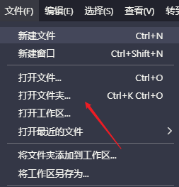

这样就将你所有 mod 内容全部加载入 CWT，这样做的好处就是避免做一个 mod 就要到处翻查，以充分节省时间与精力。

### Paradox Language Support

[Paradox Language Support](https://github.com/DragonKnightOfBreeze/Paradox-Language-Support)（以下简称 PLS）是由 @微风的龙骑士 开发的一个[Intellij IDEA](https://www.jetbrains.com/zh-cn/idea/)插件，对蠢驴的语言提供了较为完善的支持。有了它，你就可以使用强大的 IDEA IDE 开发 Stellaris（以及其他 P 社游戏）的 Mod，使用并享受其所提供的一系列强大、便捷而实用的功能。例如：代码高亮、引用解析、快速文档、代码导航、代码检查、代码补全、内嵌提示、动态模版，差异比较，等等。这个插件也支持在快速文档和内嵌提示中渲染本地化文本和 DDS 图片，也能用来直接在 IDE 中打开以及导航到 DDS 图片和 CWT 规则文件。

#### 快速上手

[Github - README - 快速上手](https://github.com/DragonKnightOfBreeze/Paradox-Language-Support/blob/master/README.md#%E5%BF%AB%E9%80%9F%E4%B8%8A%E6%89%8B)

1. 下载最新版本（编写教程时为 2023.2）的 Intellij IDEA。（直接使用社区版即可，也可以使用 JB 全家桶中的其他 IDE，例如 PyCharm）
2. 通过 IDE 打开你的模组根目录。（目前要求直接包含模组描述符文件 descriptor.mod，也可以用来打开其他游戏的模组根目录以及游戏目录，或者打开的项目目录中包含这类目录）
3. 打开模组描述符文件。（如果你没有安装此插件，此时 IDEA 应当会提示你安装，安装完成后需要重启 IDE）


4. 点击位于编辑器右上角的悬浮工具栏（或者编辑器右键菜单）中的模组配置按钮，配置模组的游戏类型、游戏目录和模组依赖。

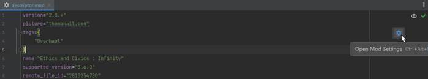

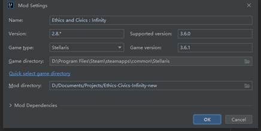

5. 点击确定按钮完成配置，然后等待 IDE 索引完成。（很快就好）
6. 开始你的模组编程之旅吧！

#### Q&A

Q：我为什么要放弃小巧、流行的 VSC，转而使用臃肿、难用的 IDEA？

A：因为 IDEA 相比 VSC 更加强大，这意味着 PLS 相比 CWTools 也可以更加强大。

Q：那么请告诉我 PLS 相比 CWTools 有哪些独到的功能？

A：要说目前最亮眼的功能，大概就是通过快速文档或者直接通过内嵌提示，提示包括本地化文本、DDS 图片、作用域上下文在内的各种信息了。

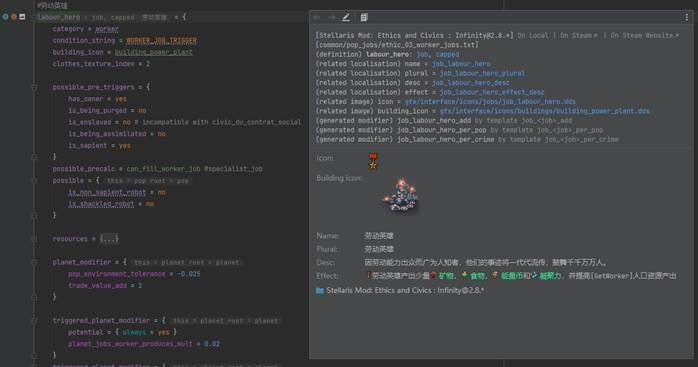

除此之外 PLS 对 SV（script_value）和内联脚本（inline_script）也提供了相当完善的支持。

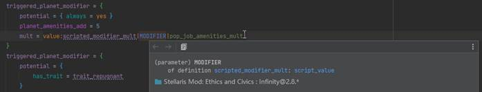

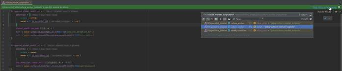

Q：那请你也说说它目前的不足之处。

A：相比 CWTools 以及个人预期，插件目前存在以下几点缺陷。

-   尚不支持[Irony Mod Manager](https://github.com/bcssov/IronyModManager)提供的一些高级功能。例如模组合并、冲突检查。
-   对于其他 P 社游戏和游戏模组的支持可能并不理想。

Q：我想提出需求或者反馈 BUG。

A：如果有任何问题，欢迎通过[Github](https://github.com/DragonKnightOfBreeze/Paradox-Language-Support/issues)或者 QQ 群（653824651）进行反馈

## 粒子编辑器

如果想要预览蠢驴的各种模型以及粒子，就可以启用粒子编辑器进行查看。首先，粒子编辑器并非一个独立的应用程序，而是包含在游戏主程序中的一个分支程序(这么说应该不严谨，不过明白意思就行 。

为了使用粒子编辑器，首先需要找到 stellaris.exe 程序位置(不是 STEAM 创建的桌面图标)右键复制，并于任意位置[粘贴快捷方式]，然后右键此快捷方式，选择属性，在[目标]处的路径后面添加:

```text
-editor -filterfile=previewer_filefilter.txt -mount="C:\Users\admin\Documents\Paradox Interactive\Stellaris\mod\[你MOD的根文件夹]"
```

注意每个“-”之前都有且只有一个空格，其余位置没有空格。

如果你的 MOD 文件夹位于其他位置，Mount 处的路径也需要相应修改来指向正确位置。

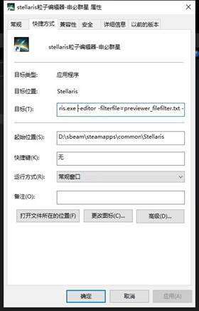

随后，前往 `Stellaris\previewer_assets` 文件夹内，打开 `previewer_filefilter.txt` ，将文件内的几个注释符“#”删除(P 社默认注释了它们，不知为何)。

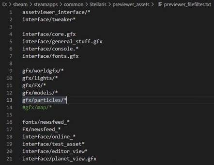

然后就可以打开粒子编辑器并使用了，部分重要按钮参考下图

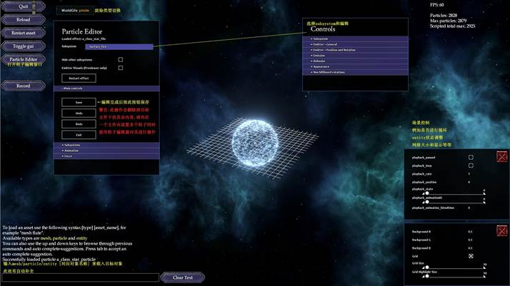

:::caution[使用提示]

有时候加载 MOD 粒子后试图打开编辑器窗口会直接崩溃，此时可以先打开一个原版粒子，打开窗口，再加载 MOD 粒子。  
或是打开 MOD 粒子，再打开原版粒子，打开编辑器，再通过左上角 PREV 切换上一个粒子。

:::
