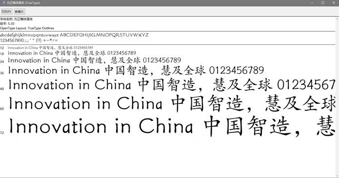
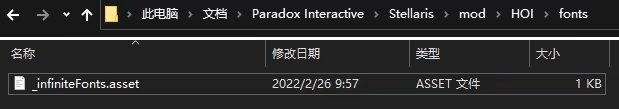

首先我们需要一个字库文件，具体怎么获取应该都知道，蠢驴原版的字库都是` .ttf` 文件，因此我们这里也采用` .ttf` 格式的字库，在获取到正常的字库文件之后你打开应该是如下差不多的格式：



确定一下有多少可用的 size 格式，到时候在注册字体文件的时候可以起到参考作用。

然后我们需要新建文件夹到和 `common` 同级的 `fonts` 文件夹下新建一个` .asset` 文件，文件名随意：



内容如下：

```pdx
bitmapfonts = {
    bitmapfont = {
        name = "infinite_regular_script_font_24"
        path = "gfx/fonts/malgun_goth_24"
        color = 0xffffffff
        cursor_offset = { -4 -3 }
        selection_offset = { 0 1 }
    }
}
```

这样我们就已经将我们的字体文件导入到了群星当中，但如果我们希望能够调用的话，还需要再进行一次注册。
到和 `common` 同级的 `interface` 文件夹下方新建一个` .gfx` 文件，文件名随意，写上以下内容：

```pdx
bitmapfonts = {
    bitmapfont = {
        name = "infinite_regular_script_font_24"
        path = "gfx/fonts/malgun_goth_24"
        color = 0xffffffff
        cursor_offset = { -4 -3 }
        selection_offset = { 0 1 }
    }
    bitmapfont_override = {
        name = "infinite_regular_script_font_24"
        ttf_font = "regular_script"
        ttf_size = "24"
        languages = { "l_simp_chinese" }
        vertical_offset = "5
    }
}
```

-   `bitmapfonts` 表示我们需要注册的类为 `bitmapfont` 合集，再嵌套一层表示为声明单个具体注册对象。
-   `name` 为我们注册该字体的名称，这也是之后我们调用该字体需要用到的 key。
-   `path` 为源 ttf 文件所在位置，应该与上方声明 font 之时的 file 的路径保持一致，但需要注意的是**这里的路径并没有带上文件名后缀.ttf**。
-   `color` 保持默认即可，该属性可以通过本地化调整，并没有什么作用；下方为光标偏移以及字体选择偏移，如果不清楚其作用，如图默认即可。
-   `bitmapfont_override` 属性表示需要重写上方注册的 `bitmapfont` 字体的某些属性并链接到我们之前注册过的 font。
-   `name` 属性与上方 `bimapfont` 声明的属性保持一致。
-   `ttf_font` 后面需要跟上我们之前注册过的 font 的 key，即 `regular_script` 。
-   `ttf_size` 后面跟上的数字则为我们注册的字体大小，依据我们之前在 ttf 文件中的大概预览可以得知我们想要的大小。
-   `languages` 表示我们需要注册到哪种语言，注意，该选项可以多次声明，如需添加其他语言则直接在后方用引号括起来：

```pdx
languages = { "l_russian" "l_polish" }
```

-   `vertical_offset` 为垂直偏移程度，这里是调整字体错位问题的属性，如果没有出现错位则可以忽视。

接下来是把字体应用到 GUI， `effectButtonType` 是 Custom GUI 绕不开的一个实用控件，这里采用一个简单示例展示如何测试字体：

```pdx
effectButtonType = {
    name = hoi_system_iron_ore
    position = {x = 20 y = 100 }
    size = { x = 500 y = 50 }
    quadTextureSprite = GFX_tile_outliner_bg
    effect = hoi_button_effect
    text = hoi_system_iron_ore_text
    format = LEFT
    font = infinite_regular_script_font_24
}
```

`font` 直接调用注册的字体 key 即可开始测试。
