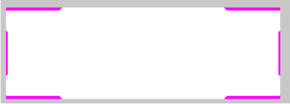

## 认识 `sprite` 与创建 `spriteType`

相信各位在尝试使用自己的事件图的时候都曾经遇到过这一难题：为什么我把自己弄好的事件图放进去 `gfx/event_pictures` 之后，在事件里直接使用 `GFX_evt_图` 的名字 这样会无效呢？明明科技图标建筑图标等等都是可以这样做的？

很明显，脑子里产生疑惑的你已经认识到，事件图所使用的图片结构与科技、建筑图标等的图片结构是不一样的，导致群星无法识别事件图的格式。那么我们该如何正确导入一张事件图呢？这个章节就由这个问题的罪魁祸首—— sprite 说起。

如果你去百度什么叫做 sprite，最前面搜出的知乎答案（不用去搜了，笔者已经搜过一遍了）可能会告诉你什么游戏引擎的 sprite 阿，还有一堆 C/C++和触发器，精灵等等的定义，但在群星里，这些东西我们统统不需要。在本章节中，我们只需要将 sprite 视作一个简单的**图层**就可以了，没错，就是 ps 里的那个图层。在群星里，sprite 只是一个处理图像的工具，并没有再被赋予什么更高大上的概念，只不过这个概念是从 2D 游戏里一直沿用下来的，所以就叫它做 sprite 了。当然谈论到实际游戏开发的概念，sprite 的定义可以说十分万能，以至于知乎给的那个答案都是争吵过好几遍才得出的较优解，但我们今天把这些概念统统抛诸脑后，只需要认识到 sprite 只是一个图像处理工具的用途即可。（跑题了跑题了）

那么，回到正题，我们该如何正确地创建一个事件图呢？首先，打开蠢驴源文件的 `interface/eventpictures.gfx` ，你会看到一大长串的代码。不过不用担心，我们只需要如下图所示的一个代码块即可（即被 `spriteType` 的括号包起来的那段代码），其他代码的格式全部都大同小异，是从这个格式复制替换过来的。

```pdx
spriteTypes = {
    spriteType = {
        name = "GFX_evt_alien_nature"
        texturefile = "gfx/event_pictures/alien_nature.dds"
        masking_texture = "gfx/interface/situation_log/event_mask.dds"
        alwaystransparent = yes
    }
}
```

在这段代码的结构里，我们首先可以看到 `spriteTypes = {}` 和 `spriteType = {}` 两段宣告代码，我们不需要理会它们是什么，只需要知道的是这是在宣告一个 sprite 类型即可，我们需要重点关注的是这个代码块里的 `name` 、 `texturefile` 和 `masking_texture` 这三个参数的定义。

首先， `name` 代表了这个 sprite 的名字，也就是引用这个 sprite 时需要填的名字，这个很好理解所以就不着笔墨了； `texturefile` 即这个 sprite 的底图。前面我说过了 sprite 在群星的作用就相当于 ps 的图层一样，因此 `texturefile` 就是用来处理这个图层的底图。注意后面是一串路径，因此你可以用来引用任意一处的图片档案，在这里我们要处理的是事件图，因此就是 `gfx/eventpicture` 里的图。最后， `masking_texture` 是遮罩图片，亦即限制图片显示区域的图层。寻着这个路径，我们可以找到这个图片是长这个样子的：



其中，紫色区域是透明的区域，白色就是不透明的区域。作为一个遮罩图片，蠢驴只会取这个文件的 alpha 值（透明值，不理解这是什么请自己百度），来决定被遮罩的文件（也就是我们的事件图）哪些地方需要显示和哪些不需要（具体来说就是将遮罩文件的 alpha 图层覆盖到原本文件的图层上）。由于事件弹框的界面是被完全限制死的，因此必须要处理成这个样子。图片以及遮罩组合起来之后，事件图就会像我们平常看到的那样是一个不规则的形状。可以看到图片的四个角落以及左右都会凹陷进去一点，这是因为经过了遮罩文件的处理，紫色位置的区域都被处理掉了。


像这样在 gfx 文件处理好之后，我们才能在事件里引用这个 sprite，并将它显示在事件弹框里，而复杂的东西群星就会自动帮你弄好了。


至于 gfx 文件，它本身就是一个 txt 文件，只是改了后缀名而已，编码上并没有什么不同……

## Sprite Type 动画

在学会如何正确导入一个事件图之后的你，开始继续了你的 mod 制作，而某一天你又遇到一个难题了：为什么遗物会有动画？而根据上面代码写的遗物并没有那个闪闪发光的动画？遇事不决先复制蠢驴，让我们来看看蠢驴的代码：

```pdx
# File: Stellaris/interface/relics_view.gfx
SpriteTypes = {
    SpriteType = {
        name = "GFX_relic_dragon_trophy",
        texturefile = "gfx/interface/icons/relics/r_dragon_trophy.dds"
        effectFile = "gfx/FX/buttonstate.lua"
        animation = {
            animationmaskfile = "gfx/interface/icons/relics/r_dragon_trophy_shine.dds"
            animationtexturefile = "gfx/interface/icons/relics/glow_overlay.dds"
            animationrotation = 90.0
            animationlooping = yes      # yes or no
            animationtime = 11          # in seconds
            animationdelay = 0          # in seconds
            animationblendmode = "add"  # add, multiply, overlay
            animationtype = "rotating"  # scrolling, rotating, pulsing
            animationrotationoffset = { x = 0.0 y = 0.0 }
            animationtexturescale = { x = 1.0 y = 1.0 }
        }
        legacy_lazy_load = no
    }
}
```

嗯？这次的代码明显长了很多？首先我们从第一部分没见过的东西一一讨论吧。

`effectFile` ：这里面的路径引用的是一个` .lua` 文件，很明显这个文件的内容已经超出本章节讨论的范围了，因此我简单给一个结论给你，它就是一个处理按钮的文件而已，也就是会将一个图片处理成光标放上去会发光，按下去会启动动画效果，sprite 所代表的代码不可用的时候会变成暗色，这样的效果。所以由于其复杂性，最好不要动它。

之后的一长串代码都在 `animation` 里，也就是我们这个章节最主要的内容：动画

要让一个 sprite 使用动画，就必须要先在 spriteType 里宣告 `animation = {}` ，然后再填入对应的参数。让我们先来看看这里面的 `animationmaskfile` 和 `animationtexturefile` 长什么样子：


<p align="center"><small>texturefile</small></p>


<p align="center"><small>animationmaskfile</small></p>


<p align="center"><small>animationtexturefile</small></p>

左图很明显就是我们游戏里干掉以太龙后拿到的龙鳞遗物的图片，中间的图是左图经过发光处理后的遮罩图，而右图是动画图。既然中间是遮罩图，我们再来换成第一章节的样子看看它实际的 alpha 图层长什么样子：（最右的那个）

可以看见大部分区域都是紫色，这也就是动画不能够显示的区域（会被遮罩裁掉的区域），因为这毕竟是动画，肯定不可能全部覆盖上去，只要让它的阴影部分有闪闪发光的效果就行了

让我们继续解析接下来的代码。

```gfx
animationrotation = 90.0
animationlooping = yes      # yes or no
animationtime = 11          # in seconds
animationdelay = 0          # in seconds
animationblendmode = "add"  # add, multiply, overlay
animationtype = "rotating"  # scrolling, rotating, pulsing
```

在 `animationrotation` 这段代码的右方，蠢驴很贴心地给了注释，-90 度是顺时针，90 度是逆时针，这段我们先跳过。

-   `animationlooping` ，这段直接翻译过来意思已经很明显了，就是动画会不会一直持续。
-   `animationtime` ，动画的持续时间（秒），也就是这个动画播放一次所需的时间
-   `animationdelay` ，循环播放的延迟时间（秒），播放完这段动画后，如果是循环播放则会延迟这个设定的时间后再次播放
-   `animationblendmode` ，动画渲染模式，蠢驴给了三种模式： `add` , `multiply` , `overlay` 。效果不明，最好跟着蠢驴走
-   `animationtype` ，动画类型，蠢驴也给了三种类型： `scrolling` , `rotating` , `pulsing` ，这里用的是 `rotating` 旋转， `scrolling` 则是平移， `pulsing` 是渐入效果（也就是从透明逐渐显示出来的那种效果）

```gfx
animationrotationoffset = { x = 0.0 y = 0.0 }
animationtexturescale = { x = 1.0 y = 1.0 }
```

最后两项参数一个是动画偏移坐标，一个是动画缩放的参数，一般来说不太用到，所以就不着笔墨了，而最后的 `legacy_lazy_load = no` 笔者也搞不清是啥东西，不要碰就行。
总结以上的参数，我们就可以得出这个遗物的动画，那就是将那个像旋风一样的贴图放在龙鳞上旋转，显示的位置则是龙鳞的阴影部分，所以看起来就会有一些闪闪发光的效果。


让我们再来看一个 sprite 动画的例子，来巩固我们刚学到的知识。

```gfx
spriteType = {
    name = "GFX_wg_gray_button_571_46"
    texturefile = "gfx/interface/wg_leader_diplo/gray/wg_button_571_46_animated.dds"
    effectFile = "gfx/FX/buttonstate_onlydisable.lua"
    noOfFrames = 3
    animation = {
        animationmaskfile = "gfx/interface/wg_leader_diplo/wg_button_571_46_animated_mask.dds"
        animationtexturefile = "gfx/interface/wg_leader_diplo/gray/wg_button_571_46_animated_texture.dds"
        animationrotation = 180.0
        animationlooping = yes
        animationtime = 40.0
        animationdelay = 0.0
        animationblendmode = "overlay"
        animationtype = "scrolling"
        animationrotationoffset = { x = 0.0, y = 0.0 }
        animationtexturescale = { x = 1.0 y = 1.0 }
        animationframes = { 1 2 3 }
    }
}
```

这是一个很常见的按钮动画（也就是鼠标放上去会有扫描的效果的那种），由于涉及到了自定义的 ui，所以笔者这次干脆放上了自己的舰 Rmod 的按钮代码上去了（毕竟是自己写的更好懂）

首先请我们的图出场（由于直接用原图会比较难以理解，所以这些图是我用 ps 润色过的）：


<p align="center"><small>texturefile</small></p>


<p align="center"><small>animationmaskfile</small></p>


<p align="center"><small>animationtexturefile</small></p>

灰色的背景是 ps 加上去的，所以灰色的部分是透明的

那么，作为练习，请自己先看一遍代码和图，根据上一章说叙述的代码，自己判断一下这个 sprite 将会产生什么效果，然后再来看下面的答案解说。

首先来看一下重要的部分：

```pdx
animationrotation = 180.0
animationlooping = yes
animationtime = 40.0
animationdelay = 0.0
animationblendmode = "overlay"
animationtype = "scrolling"
```

从 `animationtype` 我们已经可以知道，这是个平移的动画， `rotation` 是 180 度所以是向下滚动（并且第三张图会被垂直反转）， `animationlooping` 是 `yes` ，所以动画会持续播放， `animationdelay` 是 0，所以动画循环没有延迟， `animationtime` 是 40，所以整段动画从上平移到下会持续 40 秒，平移的图片对象是 `animationtexturefile` ，也就是第三张图，结合这些讯息，我们就可以想象出这个图片会在按钮上从上到下平移。由于有 `animationmaskfile` 遮罩文件的限制，所以平移的区域只限制在按钮图片上。最后的效果应该会是这样的：


但是，按钮的这个扫描效果动画，只会在按钮被鼠标碰到的情况下播放，这又是怎么回事呢？
除了这些，这次的 spriteType 还多了其他一些代码，也就是 `noOfFrames` 和 `animationframes` ，这部分的疑问将涉及到自定义 ui 的内容，因此我会将这些放到下一章节解释。

## Sprite Type 按钮

除了以上讲述的会在 common 和 event 用到的替换游戏内图片效果动画的 sprite 外，想要创造自己的 ui 就必须还有一件东西需要学会，那就是按钮。通过组合图片以及按钮，我们就可以创造一个最基本的交互界面，也就是在群星里常见的事件弹窗。


拿回上一章节的 舰 R mod 的按钮作为范例，可以看见按钮图片里并不是单独的一个框，而是有三个框从左到右平铺开来了，但进入游戏时它只会显示其中的一个，那么游戏里到底显示的哪一个呢？答案是根据按钮状态而定。一般来说，按钮会有三个状态：正常、高亮、按下，当鼠标没有触碰到这个按钮的时候，它会在正常状态，而鼠标触碰到了则会是高亮状态，最后用左键按下了按钮那么就会变成按下的状态。因此，在群星里要创建一个按钮，你必须要提供按钮的三种状态对应的图片来让游戏根据按钮状态切换图片，而提供的方法就是像上面这个图的形式，将按钮的三个状态对应的图片从左到右平铺开来。

要创建一个 sprite 按钮，只需要如下的代码即可。

```pdx
name = "GFX_wg_gray_button_571_46"
texturefile = "gfx/interface/wg_leader_diplo/gray/wg_button_571_46_animated.dds"
effectFile = "gfx/FX/buttonstate_onlydisable.lua"
noOfFrames = 3
```

其中 `name` ， `texturefile` 和 `effectFile` 已经在本章节第一节中讨论过，因此不再叙述，让我们把注意力放在最后一行代码 `noOfFrames = 3` 上：

这个 `noOfFrames` 字面意思是帧数，但实际上在 gfx 的定义，它指的是在 texturefile 存在的切片数量。简单来说，如果你填了这个参数，那么你的图片就会根据这个数值对 texturefile 在水平进行 n 等分，像上面代码填了 `noOfFrames = 3` ，那么在处理的时候游戏首先会将这个图片在水平切割出三份大小一样的图片。

切割出来的三份图片载入之后，游戏将会根据在游戏中按钮的状态来决定显示哪一个图片。

请注意，提供给 sprite type 按钮的图片按照按钮状态从左到右应当是**正常、按下、高亮**尽管这有点反常识，但确实如此，请勿将顺序打乱，因为我们是没有办法调整这个顺序的。

讲述到了这里，相信我们已经能够解答在上一章节中遗留下的问题：为什么按钮只会在高亮状态播放按钮？让我们回看一下这个按钮的动画遮罩图片：


可以发现，这个遮罩图只有在属于高亮状态的按钮的区域是白色的，其余两个状态都是紫色，也就是不显示，因此只会在按钮处于高亮状态的时候，动画才会显示，其余状态时读取的遮罩图完全是透明的，因此动画也会变成透明而不会显示。

相信你已经掌握了大部分关于 sprite type 的用法了，现在你已经可以尝试着修改组建自己的新 ui 了。不过，你还需要阅读下一章节才能够完全清楚如何真正地像小伞包和舰 r 那样完全不依靠原版代码自定义一个 ui 出来。下一章节将是对一些其他不重要的 sprite 的参数和类型的补充。

## 其他 Sprite Type

除了定义最基本的 `spriteType` 之外，我们也可以定义一些其他的 spriteType，比如舰 R 最近研发的一个逐帧动画事件图黑科技为例，它便使用了另外的 `frameAnimatedSpriteType` ：

### `frameAnimatedSpriteType`

```pdx
frameAnimatedSpriteType = {
    name = "GFX_evt_wsg_project_s"
    texturefile = "gfx/event_pictures/project_s.dds"
    masking_texture = "gfx/interface/situation_log/event_mask.dds"
    noOfFrames = 30
    transparencecheck = no
    animation_rate_fps = 15
    looping = no
    play_on_show = yes
    alwaystransparent = yes
}
```

这个 sprite 会将图片转化成逐帧图片并且循环播放，其中 `noOfFrames` 我们已经知道了，是切片数量，由于蠢驴图片是单一的静态 dds 图片，因此要做逐帧动画只能够将动画所有帧全部平铺放到同一图片中，然后使用 `noOfFrames` 切割成 n 等分来提取动画各帧的图片，而动画是有速率的，因此定义在 `animation_rate_fps` 中，其中 fps 指的是 frame pre second，因此 15 就是一秒播放 15 帧。最后， `looping` 很明显是循环播放与否， `play_on_show` 则是是否动画一出现就会播放， `alwaystransparent` 设置为 `yes` 会导致该元件不可点击，即使它是个按钮（即只作为图片的状态）

## `corneredTileSpriteType`

在蠢驴新更新的可以自定义的传统中，我们还能看见这样的sprite，这个spritetype本质上是一种填充背景用的sprite。


```pdx
corneredTileSpriteType = {
    name = "GFX_tradition_category_tile_tradition_expansion"
    textureFile = "gfx/interface/tiles/tradition_category_tile_expansion.dds"
    borderSize = { x= 140 y = 140 }
    effectFile = "gfx/FX/buttonstate_onlydisable.lua"
}
```

很明显，这是一种将图片直接放大填充所需区域用的sprite，因此这种sprite使用的图片可以弄得十分小，只有8*8，不过这和我们在传统中自定义的传统背景图有一点差别

其中 `borderSize` 指的是该元素经过拉伸之后的形成的大小（游戏会帮你处理好）


在蠢驴的传统里，所用的背景图反而是这样的一张完整的图，因此其实充当背景用的图可以大也可以小，只不过使用了这种sprite游戏就会将其拉伸至指定大小来填充背景。
