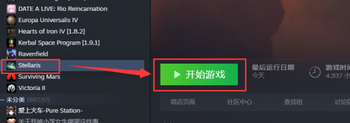

## 通过启动器

:::danger[兼容提示]

以下两种方法不兼容

:::

### 2.3 及以前

首先开启你的 stellaris 启动器，（由于现阶段的启动器中文显示有误，故截图使用英文版启动器）之后在界面内找到“**Mods**”>>>“**Mod tools**”在之后的弹窗之中，选择“**Create Mod**”.

在第一项写上你自己 mod 的名称（例如我写的“test”），第二项写上装载这个 mod 的文件夹名称，一般建议和你的 mod 名称一致，方便之后修改或者其他操作。第三项是支持的版本，没有什么特殊需求一般是保持与本版本一致。**Mod tags** 是这个 mod 的标签，有很多可以选择的项目。

当填写好这些之后，点击“**Create Mod**”，之后会在左下方显示这个 mod 被创建的路径（见图 3），如果不出现这样的信息，那么很有可能是因为文件名重复或者名字不规范，根据提示信息修改。当你做好这一步之后，那么进入该路径进行确认，比如我的路径是 `D:\Documents\Paradox Interactive\Stellaris\mod` ，可在图 4 见到确实创立了这个文件夹，以及相应名称的.mod 文件。


### 2.4 及以后

首先，需要在你的 steam 库里面打开 stellaris 的启动器（废话），操作如下图



漫长的加载之后，你应该会进入这个界面


当填写好这些之后，点击“创建 MOD”，之后会


如果不出现这样的信息，那么很有可能是因为文件名重复或者名字不规范，根据提示信息修改。当你做好这一步之后，那么进入该路径进行确认，对于大部分人而言，这个路径应该在` 我的文档\Paradox Interactive\Stellaris\mod` 目录下，比如我的路径是 `D:\Documents\Paradox Interactive\Stellaris\mod` ，可在下图见到确实创立了这个文件夹，以及相应名称的.mod 文件。


好了，现在你就成功的创建了一个 mod 了....虽然目前还没有实际上的内容。

## 通过直接修改（创建）一个新的文件夹和.mod 文件

通过对上述第一种方法的观察，我们可以发现，启动器本质上是创建了一个文件夹和.mod 文件，那么相应的，我们也可以通过直接修改他们达到一样的效果。新建文件夹不是我们的重点，重点是.mod 文件的填写。

用软件打开.mod 文件，可见以下的代码

```pdx
name = "test"                # 你所创建的mod的**名称**
path = "mod/test"            # 你所创建的mod对应的**相对路径**
tags = {                     # 这个mod的**标签**（分类）
    "Buildings"
}
picture = ""                 # 这个mod的**封面图片**（放在文件夹里面）
remote_file_id = "xxx"       # 这个mod在创意工坊的ID，**不建议修改**
supported_version = "2.2.7"  # 语义化版本。如果是x.y.*代表对全部x.y适用；x.*同理对全部x适用
```

通过修改这几项代码，从而实现对于 mod 文件的直接创造新的 mod 或者继续之前的工作（比如更改版本适应或者加入别的 mod 的内容等）

## 上传 Mod

Stellaris 游戏启动器的创建 Mod 部分有游戏自带的 Mod 上传工具。

考虑到游戏启动器网络状况不稳定，也可以使用 Steam CMD 直接上传。使用方法请参考这篇[博客](/blog/upload_with_steamcmd/)。
